---
title: Problem Set CarbonReductionCosts
output: 
  html_document: 
    keep_md: yes
    toc: yes
---


# Problem Set: Estimating CO2 Reduction Costs

Author: Daniel Dreyer


<style>
img {
    display: block;
    margin-left: auto;
    margin-right: auto;
    max-width: 100%;
}
</style>

Welcome to this `Interactive Problem Set`. During this problem set we will examine the effect of carbon taxes on emissions in the electricity sector. Coal and gas powered plants account for the majority of energy production in the United States. Since the emission levels coal generators are much higher than for gas, the goal should be to reduce the share of goal-generators to reduce $CO_2$ emissions. Therefore we will examine the effects of carbon prices on the U.S. energy market. The analysis is based on *"Inferring Carbon Abatement Costs in Electricity Markets: A Revealed Preference Approach using the Shale Revolution"* by Joseph A. Cullen, Erin T. Mansur (2016) - further referred as Cullen. You can downlaod the paper including the author's STATA code from: <a href="https://www.aeaweb.org/articles?id=10.1257/pol.20150388   target = "_blank"> https://www.aeaweb.org/articles?id=10.1257/pol.20150388</a>

Cullen and Manur examined how carbon pricing could effect emissions in the electricity sector. They took advantage of the fact that the variation in gas prices due to the Shale-Revolution provides enough data to build a model that can evaluate the effects of changing fuel costs on emissions. When introducing carbon prices they found that in comparison the cost efficiency change in favor of gas generators and they estimated that even a lower range of carbon prices of around $20 can reduce emissions by roughly 5%.  

We will use the statistical programming language `R` to replicate the analyisis proposed by Cullen. Since this problem set is meant to be interactive, you are also required to write your own code occasionally. Therefore you are required to have basic knowledge of `Statistics` and R, but I will provide information about important concepts and functions we use along the way. If you are are completely new to programming in R you should't feel left behind though. Understanding the basic concepts is pretty straight forward, you can find a useful beginners guide [here](https://cran.r-project.org/manuals.html). Below you will find an overview of content and a guideline on how to solve upcoming interactive problems.  

## Exercise Contents


$\qquad$ *Exercise 1* - Insights into Energy Markets

$\qquad$ *Exercise 2* - Theory

$\qquad$ *Exercise 3.1* - Emission Response Curves - A simple Approach

$\qquad$ *Exercise 3.2* - Restricted Cubic Spline Regression

$\qquad$ *Exercise 4* - Examining Carbon Abatement

$\qquad$ $\qquad$ *Exercise 4.1* - Estimated CO2 Response to Fuel Costs

$\qquad$ $\qquad$ *Exercise 4.2* - Estimated CO2 Response to Fuel Costs

$\qquad$ *Exercise 5* - Discussion and Conclusion

$\qquad$ *References*

### Outline

In *Exercise 1* you are introduced into the U.S. energy market. We examine basic data like fuel prices and amount of generated power. At the same time we show differences to the European Energy market and argue reasons for ceratin changes over time.
In *Exercise 2*, we introduce the theory 
In *Chapter 3*, we derive our final model over the course of several steps. In the end we want to come up with a solution that explains the effect of changing fuel costs on $CO_2$ emissions. Therefore we will start by suggesting simple linear models and work our way towards more complex approaches.  
In *Chapter 4* we then try to use the model we derived in the previous chapter and trace out the emission response curves to changing fuel costs. Afterwards we will transform the fuel costs into carbon prices and interpret the outcomes.    
At last, we will discuss and conclude our results in *Exercise 5*. Additionally we will include some robustness test which weren't part of our main analysis.


### Instructions


The problem set offers different ways of interaction. Some provide you additional information or test your knowledge, others require you to write your own code snippets. Coding exercises are marked as **TASK**. You are not required to solve exercises in the given order but its recommended. Below you can read find the different types of interactions with their corresponding functions:   

 - *Info Boxes*: Contain additional information on technical terms or documentation of functions.
 
 - *Quizzes*: Evaluate your knownledge of topics before we dive in our analysis.
 
 - *Code Chunks*: Require you to complete small parts of Code. The work flow of solving code chunks is intuitive and as followed:
                
  + `edit` : By clicking *edit* you are able to enter your own code into the chunks. You have to press that button at the beginning of each exercise to be able to solve the tasks.  
  + `run chunk`: Click this button to run the code chunk without checking for correctness.
  + `check`: Similiar to *run chunk*, you run can run the chunk but this time the problem set checks if your inputs are correct.
  + `hint` : If you have trouble getting the right solution, you can press this button to request a hint.  
&nbsp;

  Additional functions:    
                   
  + `data`: Redirects you to the data browser - you can navigate through the data set.
  + `solution` : Displays the solution of the task.  
&nbsp;


After finishing a exercise, click `Go to next exercise` at the bottom or navigate around with the help of the bar on top.


## Exercise 1 -- Insights into Energy Markets

The world has to further reduce it's $CO_2$ emissions in order to meet the requirements of the Paris Convention on Climate Neutrality by 2050. Right now the energy consumption keeps rising daily and even though new technologies are being developed to increase the percentage of `green` electricity, we are still heavily dependant on `fossil fuels`. `Coal` is hereby one of the most important sources of energy, but at the same time the biggest cause of carbon emissions. Reasons being, that it is easy to store, transport, doesn't alter and is mined in large quantities around the world. Given that coal supplies will last for centuries, it should be a major goal to find incentitives to reduce it's use and therefore emissions. We can solve this by improving the efficiency of coal-generators or we can replace it with another fuel type entirely.  
One alternative energy source is `natural gas`, which is obviously also a type of fossil fuel, but it's $CO_2$ emissions and heat density are far more efficient. Nevertheless, natural gas wasn't considered to be an real alternative to coal because of higher costs through more difficult extracting methods and handling.  
This changed with the `Shale Revolution`, which started in the early 2000s in the United States. Until then, natural gas was considered a by-product of the oil industry, but today is produced in large quantities and selectively through fracking. Lanfrancois (2012) estimated, that based on the `Clean Power Plan` introduced by the Obama Administration in 2015, $CO_2$ emissions from the electricity sector could be reduced by roughly 23 to 42 percent by replacing existing coal to gas fired generators.    
  

***

### Info: Shale-Revolution
Shale gas is a form of natural gas and is extracted from shale formation, a technology known as fracking. Since the start of this century, shale gas became a increasingly more popular form of natural gas in the United States. Whereas in the year 2000 shale gas only provided 1% of extracted natural gas in the U.S., nowadays it makes up roughly 50%. The long term effects on the environment however are highly uncertain and heavily debated.  

You can find further information on this topic below:  
<a href="https://en.wikipedia.org/wiki/Shale_ga   target = "_blank"> https://en.wikipedia.org/wiki/Shale_gas</a>s  
<a href="https://en.wikipedia.org/wiki/Hydraulic_fracturing   target = "_blank"> https://en.wikipedia.org/wiki/Hydraulic_fracturing</a>

***

  
Let's start with some interactive tasks. In `Exercise 1` we will get insights into global energy markets and explore time-series data of historic prices and generated electricity.

**Task:**
Use the `read_csv` function to load the data set `exercise1.csv` and store it in a variable called `dat`. `Read_csv` reports the variable type of each column after execution. This will come handy later on in this exercise. In future exercises we will disable this message.  


***

### Info: read.csv() and write.csv()
The command `read_csv()` reads in a **csv file** and stores it into a given variable. Csv is a format for data, that uses commas as seperators and periods as decimals. Another version for data sets are **csv2 files**, where semicolons are used for seperators and commas for decimals. We will only use csv files in this problem set.

Given you want to load a file, which is in the same working directory, you can use the command below:


```r
example <- read_csv("example.csv")
```

If the file is saved outside of your working directory you have to differentiate between two possibilities.  
For files that are "above" your current working directory, you have to provide the full path to the file. You can view your working directory with `getwd()`:


```r
example <- read_csv("C:/Data/example.csv")
```

For files that are located "below" the working directory it is sufficient to specify the file path starting with your current working directory:


```r
example <- read_csv("./Data/example.csv")
```

Csv files can be saved using the `write_csv` command:


```r
write_csv(example, file="example.csv")
```

For further information, use `help(write_csv)`.

***


```r
# ___ <- read_csv("./Data/exercise1.csv")
dat <- read_csv("./Data/exercise1.csv")
```

```
## Parsed with column specification:
## cols(
##   year = col_double(),
##   month = col_double(),
##   date = col_character(),
##   generated_coal = col_double(),
##   generated_gas = col_double(),
##   price_naturalgas_USA = col_double(),
##   price_naturalgas_Europe = col_double()
## )
```

**Task:** The first thing we should do after loading a new data set is to look at it's structure. Use the `head()` command to display the first *6* rows of the data set `dat`. When not given a second argument, `head()` displays 5 rows on default. Alternatively, you can click on `data` and get redirected to the `Data Explorer` tab, where you can navigate around the data frame and see some basic statistics.


```r
# head(dat,___)
head(dat, 6)
```

```
##   year month     date generated_coal generated_gas price_naturalgas_USA
## 1 2002     1 1/1/2002       164.3580      49.33555                 2.25
## 2 2002     2 2/1/2002       143.0488      45.06809                 2.31
## 3 2002     3 3/1/2002       151.4856      52.11839                 3.03
## 4 2002     4 4/1/2002       142.3046      50.03635                 3.42
## 5 2002     5 5/1/2002       151.4064      51.18480                 3.49
## 6 2002     6 6/1/2002       164.6677      66.63968                 3.22
##   price_naturalgas_Europe
## 1                    3.06
## 2                    3.03
## 3                    2.97
## 4                    2.81
## 5                    2.83
## 6                    2.90
```

The data frame includes 214 observations of *monthly* data from the year 2002 to 2019. It contains data of generated power in MWh in the U.S. as well as prices of natural gas in Europe and the United States. Keep in mind that different commodities are traded in different units, coal in metric tons (`\$/mt`) and gas in million British thermal units (`\$/mmBTU`). I mentioned that it would come handy to know which data types our columns inherit, hovering over the column names in the output above will give you the same information. R requires `dates` to be stored as type `Date` to be able to create plots along a time line. Since the date column is currently stored as type `character` we have to convert the variable into the right format by using `as.Date()`.

**Task:**  Transform the data type with `as.Date()` and store it under the same name.

```r
# ___ <- ___(___, format="%m/%d/%Y")
dat$date <- as.Date(dat$date, format="%m/%d/%Y")
```

Now that we imported our data set and processed it for analysis, let's start exploring. First, we create a plot that tells us more about the price development of gas in both regions. Because of the fact that the Shale-Revolution started in the beginning of this century, we expect a increasing supply and therefore falling prices of natural gas in the United States. Since commodity markets are split into regions, the European Prices should somehow differ.  
Besides basic R, we are able to import a variety of custom packages that extend it's functionanlity. For example, there are several packages that let us create highly customizable plots. We will mostly use the package `ggplot2`, which is widely considered to be one of the most powerful packages to create plots, having the downside that the handling can be a bit tricky. Therefore, you aren't required to create entire plots on your own but but to fill in gaps. This way you get used to the logic behind ggplot2 and at the same time won't get frustrated if your output didn't meet the exact requirements.  
  
**Task:** Use the data frame `dat` to plot `historic prices` of natural gas in Europe and the United States along `date` on the x-Axis.


***

### Info: ggplot2
The package `ggplot2` is a powerful data visualization package for R, which is part of the `tidyverse` environment. Besides basic functions that are also provided by native R, it allows the user to create highly customizable graphs by **altering**, **adding** or **removing** components.

You are not required to have deeper knowledge about the functionality of ggplot2. However, you can find further information [here](https://ggplot2.tidyverse.org/) or type `help(ggplot2)`.

***


```r
#ggplot(data=___, aes(x=___)) +
#  geom_line(aes(y=dat$price_naturalgas_USA, color="United States"), size=1) +
#  geom_line(aes(y=dat$price_naturalgas_Europe, color="Europe"), size=1) +
#  labs(x = "Year", y = "", title = "Natural Gas Prices", subtitle = "Y=$/mmBTU")+
#  scale_color_manual(name="Region",values = c("blue","red"))
ggplot(data=dat, aes(x=date)) +
  geom_line(aes(y=dat$price_naturalgas_USA, color="United States"), size=1) +
  geom_line(aes(y=dat$price_naturalgas_Europe, color="Europe"), size=1) +
  labs(x = "Year", y = "", title = "Natural Gas Prices", subtitle = "Y=$/mmBTU")+
  scale_color_manual(name="Region",values = c("blue","red"))
```

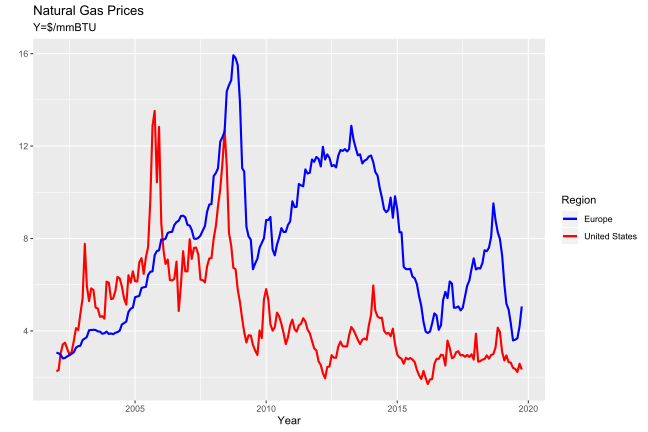<!-- -->

Looking at the plot, our assumptions are confirmed. The spikes in 2005 and 2008 are mostly consequences of the Iraq War and the Financial Crisis. Apart from that, we observe decreasing gas prices in the U.S. from just over \$12 in 2008 to under \$2 in 2016 and fluctuated around roughly the same level.  
Natural gas prices in Europe remained at a significantly higher level. One reason being, that fracking isn't as popular in Europe, therefore a major part of gas gets imported from Russia, which drives prices. Additionally, Europe has a quite different energy mix in comparison to the United States. According to the European Environment Agency (EEA), the consumption of gas decreased in average by 1.4% per year since 2005 in Europe, whereas in the U.S. natural gas reached new all-time highs almost every year.  

Besides information about fuel prices, our data frame also contains data of generated power in the United States. Before we take a look at the time-series for this, take your first quiz:  


Quiz: Did the proportion of gas-generated electicity increase or decrease over time in comparison to coal-generated electricity ?

- increased [x]

- decreased [ ]

&nbsp;

**Task:** Create a new plot for generated electricity. Plot `date` on the x-Axis and the generated electricity on the y-Axis. We want seperate lines for `gas generated power` as well as `coal generated power`, which can be added with `geom_line`. For reference you can take the code from the previous graph or conduct the `help()` function.


```r
#ggplot(data=___, aes(x=___)) +
#  ____(aes(_=dat$generated_coal, color="Coal Generation (TWh)"), size=1, alpha=0.5) +
#  ____(aes(_=dat$generated_gas, color="Natural Gas Generation (TWh)"), size=1, alpha=0.5) +
#  labs(x = "Year", y = "", title = "Monthly Generation by Fueltype", subtitle = "Y=Monthly Electricty (TWh)")+
#  scale_color_manual(name="",values = c("black","red"))+
#  scale_y_continuous(breaks=seq(0,200,25))
ggplot(data=dat, aes(x=date)) +
  geom_line(aes(y=dat$generated_coal, color="Coal Generation (TWh)"), size=1, alpha=0.5) +
  geom_line(aes(y=dat$generated_gas, color="Natural Gas Generation (TWh)"), size=1, alpha=0.5) +
  labs(x = "Year", y = "", title = "Monthly Generation by Fueltype", subtitle = "Y=Monthly Electricty (TWh)")+
  scale_color_manual(name="",values = c("black","red"))+
  scale_y_continuous(breaks=seq(0,200,25))
```

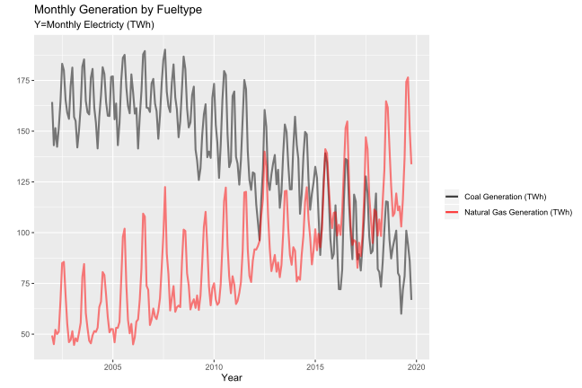<!-- -->

The results are in line with what we should expect. With a higher supply of gas and decreasing prices, gas plants increased their share in power generation over time. Giving you a bit more background: Coal-fired generators tend to have lower operating costs than gas-fired ones, but are expensive to start and adjust slowly to fluctuating demands. Gas-generators can fill these gaps. The first of two different types are `peaker plants`. They run in high demand hours due to their fast start-up times, but on the downside suffer from high marginal costs. The second type are `combined cycle gas turbines` (CCGT). They have low heat rates (high efficiency of turning fuel into power) and are used to provide baseline power generation throughout the day.  
Combining the factors above, we see that both fuel-generators have the possiblity to generate power in all situation and meet the general needs of electricity, meaning that the fuels are `switchable`. However, the mechanism of `fuel switching` is a lot more complex than just about the cost efficiency. We already mentioned some factors above, but capacity of plants, transmission grid limits (Mansur & White 2012, Davis & Hausman 2015) or market power of firms (Bushnell, Mansur & Saravia 2008) also play a big role.    
To wrap this up, we observe severe fluctuations of generated power along the year, that occur with smaller peaks in summer and a bigger ones in winter season. These fluctuation are largely driven by using air conditioning in summer and space heating in winter (EIA, "Today in Energy", 2020/3).  
  

***

### Award: Artist
You created your first plots! You will earn more awards throughout the problem set. After you completed all exercises you will see how many awards you achieved.

***


Click `Go to next exercise` to continue.


## Exercise 2 -- Theory

### Relationship between Fuel and Carbon Prices

In this exercise we work towards a method that connects the mechanism of `fuel switching` to our analysis. We already mentioned, that there are several factors that influence the usage of certain fuel types. We will include some of them later in our analysis, but for now we keep it simple and only consider prices.  
In case we would decide which fuel to use for power generation in terms of costs, `marginal costs` would play a central role. Per defintion, marginal costs not only include the price of fuel, but include all costs that are incurred in producing additional units of electricty (MWh).  
Cullen hereby defined a formula which defines `marginal costs` as a Equation of `heat rate` and the `costs of burning fuel`. Variable names of this exercise are explained in the info-box below:

$$\tag{1}MC=HR\cdot(P_{fuel}+CO_{2,fuel}\cdot P_{co2})=HR\cdot C_{fuel}$$


***

### Info: Variable names
$MC$: Marginal Costs  
$HR$: Heat Rate, mmBTU/MWh  
$C_{coal}$: Cost of burning coal  
$C_{gas}$: Cost of burning gas  
$P_{coal}$: Coal Price, $/mmBTU  
$P_{gas}$: Gas Price, $/mmBTU  
$CO_{2,coal}$: Carbon content of coal, tons/mmBTU  
$CO_{2,gas}$: Carbon content of gas, tons/mmBTU  
$P_{co2}$: Carbon Price , $/ton

***


At the beginning of this problem set we mentioned, that it has to be a central goal for us to reduce emissions. We also saw, that the proportion of gas and coal have converged considerably over time. Apart from relying on the effects of the normal economy, where demand meets supply, we need to find further incentives to increase the share of gas. To reinforce this we can use the fact, that coal contains approximately twice as much $CO_2$ as natural gas. This relates to higher emissions per generated unit of electricity for coal-generators and therefore we can introduce *carbon prices*. Besides the effect on cost efficiencies, the momentum is additionally driven by the fact that the heat rate of gas generators is generally more efficient.
Combining these two facts lead to `steeper marginal costs` for coal generators when carbon prices are introduced. Reflecting this to our upcoming analysis, we won't observe carbon prices in our data, but a variation in fuel costs.  We can explain the variation of both fuel costs by creating a factor of `cost ratios`:

$$\tag{2}costratio=\frac{C_{coal}}{C_{gas}}$$


This will help us to explain the relationship of both fuel costs in a single variable and therefore simplifies our model and interpretation. By combining Equation `1` with Equation `2`, we can explain `cost ratios` as a function of `fuel prices`, `carbon content` and `carbon prices`:

$$\tag{3}costratio=\frac{C_{coal}}{C_{gas}}=\frac{P_{coal}+CO_{2,coal}\cdot P_{co2}}{P_{gas}+CO_{2,gas}\cdot P_{co2}}$$

Our eventual goal is to find the response curves of emissions to changing `carbon prices`. You may ask yourself why we build equations that are mainly focused around fuel costs. Because of the fact that we observe a variance in fuel costs, we can calulate cost ratios at various levels of emissions. Carbon prices hereby would directly effect the marginal costs of our fuel types and therefore change cost ratios. This relation is explained with the equation above.  
In the following section we will further explain the mechanism behind cost ratios. To be able to better understand the relation we have agree on a base-level of prices for both fuel types. Ideally we want to set a base level that is based on future price predictions, meaning that in the end we want to achieve a result which shows us the changes in emissions in relation to these base prices. Luckily the `EIA` provides predictions for the year 2025. For completeness I also report the values of carbon content $CO_{2,coal}$, which we need later on and are provided by the `EIA` as well:

- Average delivered coal price `$2.25/mmBTU` and gas prices `$5.75/mmBTU` (forcast for 2025)
- Carbon content `Natural Gas`: 117 lbs carbon/MMBTU or `0.0585 tons/MMBTU`  
- Carbon content `Coal`: 210.8 lbs carbon/MMBTU or `0.1054 tons/MMBTU`  


Quiz: What happens to our cost ratio accorging to Equation 2, if natural gas doubles in costs and coal costs goes down by 25%.

- Rise [ ]

- Equal [ ]

- Fall [x]

&nbsp;

This relation is obviously quite intuitive. By adding carbon prices as seen in `Equation 3` it gets a bit more complex. This is visualized in the graph below. The values of fuel costs correspond to the base prices mentioned above.  


Source: Cullen 
  
Panel `(a)` shows the relationship between fixed costs of `coal` and `gas` when `carbon prices` get introduced. As explained, this leads to steeper marginal costs for coal and at a certain level, natural gas becomes more cost efficient. Panel `(c)` displays the results when transforming fuel prices in cost ratios as defined in `Equation 2`. This transformation has the advantage that we can reduce the relation of fuel costs into one line and makes the interpretation of our results much easier.  
Panel `(b)` and `(d)` plot the same relation, but this time in absence of carbon prices and with fixed coal prices. The message you should get here is, that we can find the same cost ratios (`red lines`) with both approaches.


Quiz: Can we create any cost ratio under the assumption that we introduce carbon prices under fixed fuel prices?

- Yes [x]

- No [ ]

&nbsp;

In summary, the answer to the quiz above is the central idea behind our analysis. We use variations in cost ratios and build a model that predicts the effects changing fuel costs on $CO_2$ emissions. With the introduction of carbon prices it would be interesting to directly know the effects of certain levels of carbon prices on emissions. Therefore, we can rearrange `Equation 3` to carbon prices, which will find its use at the end of our main analysis:

$$\tag{4}{P_{co2}}=\frac{costratio\cdot{P_{gas}}-{P_{coal}}}{CO_{2,coal}-costratio\cdot CO_{2,gas}}$$

<br/><br/>
  
Since it's not common in Europe to have the kind of electricity grids as in the United States, we will introduce the concept of `Interconnections` in the following sub-section.

### Interconnections

The American Electric system is made up of three major `Interconnections`, that in turn consist of different balancing authorities (responsible for maintaining the electricity balance within the region). Local electricity grids are hereby connected to form a network, which provides higher stablity and reliability.  
Interconnections hereby operate mostly independent from each other and exchange little to no electricity, which is a huge difference in comparison to the European electricity grid, where grid stability is ensured across borders.

In the graph below you can see the three interconnection we include data of in this problem set. I listed a few details for each below:
- `Eastern Interconnection (EAST)`: Consists of 36 balancing authorities and extends from the East Coast to the Rocky Mountains.
- `Western Interconnection (WECC)`: Involves 37 balancing authorities, which are located in the West of North America.
- `Electric Reliability Council of Texas (ERCOT)`: Consists of large parts of Texas


Source: Cullen

In the section above we already stated that in a first step we want to find a model that explains the relation between cost ratios and emission. Since we are essentially observing three different energy markets, we should examine the distribution of data points and determine whether we can create one model for the entire market or seperate it by interconnection. We will present the data in detail in the upcoming chapters, for now we create a graph that plots the cost ratio against $CO_2$ emissions and additionally encircles the data to its corresponding interconnction.

**Task:** Just press *check*.


***

### Info: geom_encircle()
`Geom_encircle()` is part of the package `ggalt` which extends the functionality of `ggplot2`. It provides a additional library of pre-defined functions and just adds to the standard package. We use the function `geom_encircle()`, which automatically encloses points in a polygon and can be used to visualise differences in groups of data.

Call `help(geom_encircle)` or click [here](https://github.com/hrbrmstr/ggalt) for additional information.

***


```r
dat <- read_csv("Data/exercise2.csv")
ggplot(dat,aes(x=coalprice/gasprice,y=co2mass/1000,color=intercn))+
        geom_point(alpha=0.2) +
        geom_encircle(aes(group=intercn,fill=intercn),alpha=0.3, s_shape=1) +
        theme_bw()+ 
        labs(y="", 
        x="Cost Ratio", 
        subtitle="y=CO2 Emissions in 1000 tons/day",
        title="Distribution of data")
```

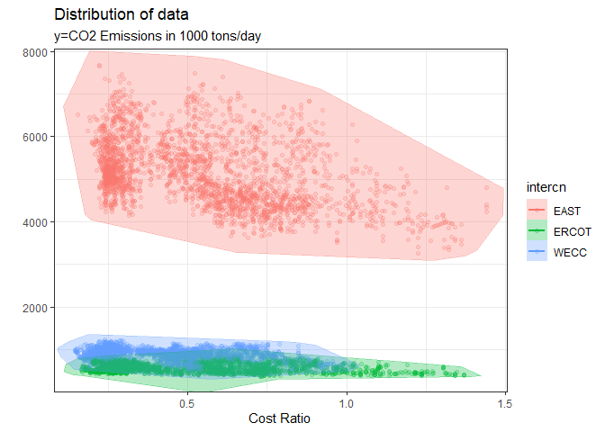<!-- -->

The plot shows us the data points and their associated "clouds" for each interconnections. The thing that should strike you here is that each interconnections has vastly differect characteristics. Higher emissions as seen in the `Eastern` Interconnection implicate a larger grid, whereas the other two regions are way smaller in terms of emissions. Addtitionally, the distribution of the data points across regions indicate that is hardly possible to fit a model for the entire market. We could probably find a model that fits well for the Texas (`ERCOT`) and Western (`WECC`) Interconnection, but its unlikely to fit `EAST` as well. Because of this we will perform our analysis on each `interconnection` seperately.


***

### Award: Theorist
Even though this chapter was a bit "dry", you learned quite a bit! You are ready to start working on the model.

***


In the next chapter we will start building a mathematical model that is based the theory we introduced in this exercise. Click `Go to next exercise`.


## Exercise 3.1 -- Emission Response Curves - A simple Approach

A short recapture: Up to this point we got some insights into the U.S. energy market and introduced the concept of mapping cost ratios to emissions. In this exercise we will combine these findings and develop a model which will allow us to predict the impact of changing fuel costs on emissions. We start by proposing a simple linear model and work our way towards more complex but also more precise ones.  
If you are purely interested in the final model and the economic impact, you can skip to `Exercise 4.1`. The next two exercises will focus on regression theory, which build a basis to understand the methods we use for our main analysis.

**Task:** To get started, load the data set `exercise3.csv`, press `edit` and `check` afterwards.


```r
dat <- read_csv("Data/exercise3.csv")
head(dat,3)
```

```
##       date month year intercn   co2mass gasprice coalprice      load
## 1 1/1/2006     1 2006    EAST 4548660.4  9.34131   2.05989 6454708.0
## 2 1/1/2006     1 2006   ERCOT  452107.9  7.58753   1.66738  616973.4
## 3 1/1/2006     1 2006    WECC  775122.7  7.81944   1.62992 1587397.1
```

Due to the size of the original data sets we skip the data preparation in this problem set but rather provide the data sources and work with the final data set. It consists of 7671 observations from 2006 onwards and is aggregated daily and seperated by interconnection. Along the way we will expand the data set with additional variables, you can find the meaning of the variables and it's associated units below:  

`co2mass`: $CO_2$ Emissions in tons  
`gasprice`: Capacity weighted average daily gas costs ($ per million BTU)  
`coalprice`: Costs of Coal ($ per million BTU)  
`load`: Daily electricity consumption in MWh  

The data are gathered from several official U.S. agencies, `Emission` data are measured by the Continuous Emissions Monitoring System (CEMS) of the `Environmental Protection Agency (EPA)`. The U.S. Energy Information Administration (EIA) collects data of `coal prices` in Form 923. Spot prices for `gas` can be found at the `Intercontinental Exchange (ICE)` and data for `electricity consumption` or `load` are provided by the `Federal Energy Regulatory Commission (FERC)` in Form 714.  
As mentioned in `Exercise 2` it makes sense for us to run our model on each `interconnection` seperatly. For this purpose we will filter our data set for interconnection `EAST` and develop the model based on these data. Once we find a fitting model we will run it on each interconnection and merge our results. For this chapter and for ease of interpretation we convert emissions and load from tons to million tons.  

**Task:** Use the pipe operator `%>%` to combine following tasks: Filter the data set `dat` for interconnection `EAST` and store it in `dat_east`. Additionally, calculate the cost ratio between `coalprice` and `gasprice` according to `Equation 2`.


***

### Info: Pipe(), Select(), Filter(), Mutate()
The pipe operator `%>%` is a feature provided by the `dplyr` Package. Essentially it allows us to exectute multiple operation on a dataframe at once. Hereby, every pipe operator returns a dataframe and passes it to the next connected function.  
`Select()` filters for certain columns of data, whereas `filter()` does the same for rows.  
If you want to create new columns or alter existing, you can use `mutate()`. There are several more functions to alter your data sets, below you find a handy cheat sheet.
  

```r
example %>% 
  select(1:5) %>%  # keep certain columns from index 1 to 5  
  mutate(new_column = old_column+1) %>% # create or alter columns   
  filter(columnname=="value") # filter for argument
```

You can find a more detailed cheat sheet [here](https://rstudio.com/wp-content/uploads/2015/02/data-wrangling-cheatsheet.pdf) or use the `help()` function.

***


```r
# ___ <- data ___ 
#  mutate(costratio = ___/___,
#         co2mass = co2mass/1000000),
#         load = load/1000000) ___
#  filter(intercn=="___")
dat_east <- dat %>% 
  mutate(costratio = coalprice/gasprice,
         co2mass = co2mass/1000000,
         load = load/1000000) %>%
  filter(intercn=="EAST")
```


### Linear Regression

The easiest way to start is to propose a simple linear regression model that predicts emissions purely on the basis of a linear relationship to cost ratios. In mathematical terms we can express the relationship as followed, with $c02mass_{2t}$ for mass of $CO_2$ emissions, $\beta_t$ for our coeffcients and $\epsilon_t$ for the error-term:

$$co2mass_{2t}=\beta_{0}+\beta_{1}\cdot costratio_{t}+\epsilon_t$$


***

### Info: Linear Regression with lm()

`Lm()` is part of the `stats` package, which is loaded on default. As shown in the syntax example below, it enables you us to regress `y` on the indepedent variables `x1` and `x2`. The model itself is handled just like every other variable, which can either be stored or used in other functions. Another popular function to solve linear regressions in R is `felm()`, which provides further functionality e.g. for including `fixed effects`. Because we won't model fixed effects here, we will strictly use `lm()`.


```r
example <- lm(y~x1+x2, data=dat_east)
```

You can find more information [here](https://www.rdocumentation.org/packages/stats/versions/3.6.2/topics/lm) or use the `help()` function.

***


**Task:** Run a regression with `co2mass` as the dependent variable and `costratio` as independent variable. Use `dat_east` and store it in the variable `fit`. 

```r
fit <- lm(co2mass ~ costratio, data=dat_east)
```

To show the summary statistics of our first regression, R provides a function called `summary()` on default. Since it's output is pretty static, we will use `stargazer()` instead. The function allows us to custimize the output to our needs and it supports `html` format. Therefore, we define our own version of stargazer() and at the same time introduce custom functions which will be useful later on. Read the `Info Boxes` below to find out more.  

**Task:** Just press *check*.


***

### Info: Stargazer
`stargazer` provides specialised `HTML` formatting for regression tables and summary statistics. It is easy to use, supports a large number of model types and formats data in a more pleasing way. The basic function is called by `stargazer()` ,but can be heavilycustomized. For further information type `help(stargazer)` or click [here](https://cran.r-project.org/web/packages/stargazer/).

***


***

### Info: Custom functions
R provides an easy framework to add our own functions. The syntax is quite similar to other programming languages you could be familiar with and you can use these functions as long as you are in the same session. Below you find the basic structure and an example:


```r
`myfunction <- function(arg1, arg2, ... ){`  
`statements`  
`return(object)}`
```
Here's an simple functions that adds `5` to the input:

```r
`example <- function(x) {`  
  `x + 5`  
`}`  
`example(1)`
```
You find more information [here](https://www.rdocumentation.org/packages/base/versions/3.6.2/topics/function).

***


```r
show.regression= function(...){
  library(stargazer)
    stargazer(..., 
            type = "text", 
            style = "aer",  
            digits = 3,
            df = FALSE,
            report = "vct*",
            star.cutoffs = c(0.05, 0.01, 0.001),
            model.names = FALSE,
            object.names = TRUE,
            model.numbers = FALSE, 
            omit.stat=c("f", "ser")
    )
}
```


Quiz: Before taking a look at the summary, how do increasing cost ratios effect emissions?

- With increasing cost ratios emissions will increase. [ ]

- With increasing cost ratios emissions will fall. [x]

  
**Task:** Use the function we defined above to display the summary statistics of `fit`.

```r
show.regression(fit)
```

```
## 
## =====================================================
##                              co2mass                 
##                                fit                   
## -----------------------------------------------------
## costratio                     -1.306                 
##                           t = -25.065***             
##                                                      
## Constant                      5.877                  
##                           t = 184.852***             
##                                                      
## Observations                  2,557                  
## R2                            0.197                  
## Adjusted R2                   0.197                  
## -----------------------------------------------------
## Notes:       ***Significant at the 0.1 percent level.
##              **Significant at the 1 percent level.   
##              *Significant at the 5 percent level.
```


We observe a positive intercept term $\beta_0$ with 5.87704 and a negative coefficient for $\beta_1$ of -1.30554, meaning that emissions fall with an increasing cost ratio. The three stars next to our coefficents imply that the t-value is significant at the 0.1 percent level. Therefore, the coefficients are inconsistent with the null hypothesis and it may be rejected. In other words the probabiliy of finding an estimator that is at least as high as the one we predicted is smaller than 0.1 percent.  


***

### Info: R-squared
`R-Squared` is a statistical measurement that represents the correlation between `fitted values` and `observed values`. R-squared is hereby always positive and ranges from 0 to 1. A value closer to 1 indicates that the suggested model explains a majority of the variance in the outcome variable.  Mathematically we can descibe this as followed: 
$$R^{2}=1-\frac{Explained\ Variation}{Total\ Variation}$$
A problem with this indicator is that it only works as intended for models with one independent variable. For multiple regression models R-Squared should be adjusted because it naturally increases with higher amounts of variables, even if these variables are only barely responsible for the predicted values. `Adjusted R-Squared` solves this by taking the amount of variables into account, which avoids an false impression and is also shown in the summary statistics.

***


Next, we determine if the model fits the data. One possibiliy is to use the `R-Squared` indicator, which measures quite low at $19.7%$. However, we should take this measurement with a grain of salt. As mentioned before, our coefficients are statistically significance, therefore we are still able to draw conclusions from our results as shown above. With this in mind there's much room of improvement in terms of the overall fit of our model, which we will improve going further.


### Multivariate Regression Models

If we look back at the implications of the energy market from `Exercise 1`, we can argue that there are several other factors next to costs that influence $CO_2$ emissions of energy generation. To include additional effects in our model we can use `Multivariate Regression Models`. For now, we add the effect of `electricity consumption` or `load`. Our regression formula changes to:   
$$co2mass_{2t}=\beta_0+\beta_1\cdot costratio_t+\beta_2\cdot load_t+\epsilon_t$$

**Task:** Run a regression based on the regression formula from above. Use the same data frame `dat_east` and store it as `fit1`. Additionally, use `show.regression()` to output the summary statistics of `fit` and `fit1`.

```r
fit1 = lm(co2mass ~ costratio + load, data=dat_east)
show.regression(fit,fit1)
```

```
## 
## ======================================================
##                               co2mass                 
##                      fit                  fit1        
## ------------------------------------------------------
## costratio           -1.306               -0.751       
##                 t = -25.065***       t = -46.157***   
##                                                       
## load                                     0.774        
##                                      t = 157.897***   
##                                                       
## Constant            5.877                -0.196       
##                 t = 184.852***       t = -4.942***    
##                                                       
## Observations        2,557                2,557        
## R2                  0.197                0.925        
## Adjusted R2         0.197                0.925        
## ------------------------------------------------------
## Notes:       ***Significant at the 0.1 percent level. 
##              **Significant at the 1 percent level.    
##              *Significant at the 5 percent level.
```

The effect of `costratio` is around half as large as before. `Load` has a positive coefficient $\beta_2$ of 0.774, which is also quite logical since emissions should increase with more generated electricity. We see that fuel costs and the generated electricity both have nearly the equal effect on $CO_2$ emissions for this model. According to the t-values, all coefficients are  siginificant, but we observe a big difference in the `R-squared` measurement. In contast to our first model, the second model explains a vast majority of the obvserved values With $92.5\%$.  
Concluding this we see some improvement in our statistics when introducing a second coefficient to our model. Let's pretend we are satisfied with our results from `fit1` and we follow along our analysis. As long as we keep our models that simple, we can directly draw conclusion from the summary statistics. However, if we continue to add more variables to our model and introduce additional statistical methods this won't be that easy. Therefore, having a well fitted model is just the first step for us. In the end we want to create a graph that plots the response curves of emissions against changing costs of fuel. To do this for any model, we first have to calculate the fitted values based of our model. R provides a function exactly for this case, called `predict()`.  

**Task:** Predict the fitted values of `fit1` on `dat_east` and store it in `co2.hat1`.


***

### Info: Predict
We can predict the corresponding fitted values of our model with the `predict()` function. As minimum arguements it takes the fitted model and a data frame in which the functions looks for variables to predict from:  


```r
fitted.values <- predict(model, data)
```

***


```r
#co2.hat1 = ___
co2.hat1 = predict(fit1, dat_east)
```

Now, that we calculated the fitted values we can proceed and plot cost ratios against the fitted values of emissions. However due to the fact that we added load to our model, we have a multivariate regression model with two independent variables, which graphically spans over three dimensions. To illustrate this problem let's create a plot for `fit1`.

**Task:** Just press *check*

```r
#take sample from data to limit points shown in plot
temp<- dat_east %>% cbind(co2.hat1)
temp1<- temp[sample(nrow(temp), 150), ]
#assign vairables to axises
x <- temp1$costratio
y <- temp1$load
z <- temp1$co2.hat1
#set a nice color scheme
numbercol <- 8 # number of colors
plotcolor <- brewer.pal(numbercol,"Reds") # use Brewer to get color scheme 
colornum <- cut(rank(z), numbercol, labels=FALSE)
colorcode <- plotcolor[colornum] # assign color
#plot
s3d <- scatterplot3d(x,y,z, col.axis="gray", col.grid="gray", type="h",color=colorcode, 
angle = 35, scale.y = 1, pch = 19, xlab="Cost Ratio", ylab = "Load", zlab = "Emissions")
s3d$plane3d(fit1, lty = "dotted")
```

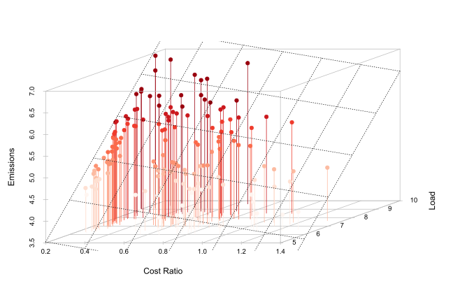<!-- -->

Because of the vast amount of observation I limited the data points plot to a sample size. The predicted emissions are plotted as dots and the corresponding regression plane (dotted line) alongside. Of course it would be a valid solution to visualize our results that way, but since we want to produce robust scientific results we want to visualize ou results in a two-dimensional graph. 
Nevertheless, there are some obvious problemS if we would proceed. Since it is not that common to plot regressions, let's see what would happen if we continue and simply plot our fitted values for `fit1`. For purpose of illustration, run the code below.

**Task:** Just press **check**

```r
ggplot(dat_east,aes(x=costratio,y=co2.hat1))+
        geom_line(aes(x=dat_east$costratio, y=co2.hat1))+
        labs(y="Emissions", x="Cost Ratio")
```

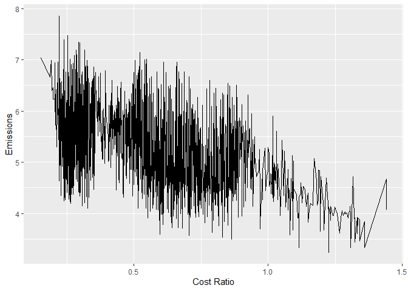<!-- -->

`R` hereby follows it's intential purpose and connects all fitted values along the range of cost ratios. Since we don't consider the `load` variable in the two-dimensional plane, we get a output that is not at all what we want. To solve this issue we will use a work around in the way that we won't predict our fitted values on the original data frame we used to build our model on. Instead we evaluate all independent variables with exception of cost ratios at their respective means. This is possible, because the average of the fitted values $\hat{y_i}$ are equal to the average of the actual values $y_i$: 

$$\frac{1}{n}\sum_{i=1}^n \hat{y_i}=\frac{1}{n}\sum_{i=1}^n y_i$$

This is true for linear regressions with an intercept term (Sarndal, Swensson and Wretman, 1992). The sum of the residuals of the variables equal to zero in this case.  
To implement this method into our analysis we create a new data frame with the means of our independent variables (except cost ratios). At this point we only added `load` to our model, therefore we include `costratio` and the mean value of `load`. Afterwards we can use these data to run `predict()` on. At the end of this exercise we will once more plot our reponse curves and see the effects of this approach on our plots.

**Task:** Just press *check*.

```r
pred_dat = tibble(co2mass = dat_east$co2mass, costratio = dat_east$costratio) %>%
  cbind(load=mean(dat_east$load))
```

### Non-linear Models

Now, that we are able to plot multivariate regressions into a two-dimensional grid, we continue to further develop our model. Our previous models assumed a linear relationship between emissions, fuel prices and load. Given the complexity of electricity markets and the statistics we gathered up to this point, we should assume a more complex relationship in form of a highly non-linear response of emissions. The type of regression that fits a non-linear relationship between dependent and independent variables is called `Polynomial Regression`. The easiest way to transform our previous model is to replace the linear variable with a cubic function:

$$co2mass_{2t}=\beta_0+\beta_1\cdot costratio_t+\beta_2\cdot costratio_t^2+\beta_3\cdot costratio_t^3+\beta_4\cdot load_t+\epsilon_t$$

**Task:** The syntax in R to create a cubic function is `poly()`. We can include all grades of the polynomical function but since `R` does this on it's own, it is enough to define it as followed. Just press *check*.

```r
fit2 = lm(co2mass ~ poly(costratio,3, raw = TRUE) + load, data=dat_east)
show.regression(fit1, fit2)
```

```
## 
## =========================================================================
##                                                  co2mass                 
##                                         fit1                 fit2        
## -------------------------------------------------------------------------
## costratio                              -0.751                            
##                                    t = -46.157***                        
##                                                                          
## poly(costratio, 3, raw = TRUE)1                             0.943        
##                                                          t = 3.871***    
##                                                                          
## poly(costratio, 3, raw = TRUE)2                             -2.627       
##                                                         t = -6.970***    
##                                                                          
## poly(costratio, 3, raw = TRUE)3                             1.184        
##                                                          t = 6.852***    
##                                                                          
## load                                   0.774                0.773        
##                                    t = 157.897***       t = 158.893***   
##                                                                          
## Constant                               -0.196               -0.491       
##                                    t = -4.942***        t = -8.460***    
##                                                                          
## Observations                           2,557                2,557        
## R2                                     0.925                0.927        
## Adjusted R2                            0.925                0.927        
## -------------------------------------------------------------------------
## Notes:                          ***Significant at the 0.1 percent level. 
##                                 **Significant at the 1 percent level.    
##                                 *Significant at the 5 percent level.
```

The summary shows the statistics for the linear (`fit1`) and polynomial model (`fit2`). The first thing we can observe is, that R provides a coefficient for every grade of the cubic function. Mathematically the cubic function is noted as $-10.059x-0.287x^2+1.444x^3$ and we can calculate the positive turning point with: $\frac{∂(-10.059x-0.287x^2+1.444x^3)}{∂x} = 0 => 2.74058$. This means, that `costratio` has no futher positive effect on emissions when its' value is greater than 2.74. The value of $R^2$ is comparable between both models, but as mentioned before we shouldn't purely rely on this measurement. Since we stated that emissions should follow a highly non-linear reponse, we can assume that the non-linear model is a far better fit, even though the statistics are comparable.  
We finish this exercise by plotting the reponse curves once again with the method we introduced before. First, we predict the fitted values on the new data frame, afterwards we can create our plot as usual.

**Task:** Run `predict()` on `fit1` and `fit2`. We already predicted values for `fit1`, but this time we use the data frame `pred_dat`.

```r
#co2.hat1 = ___
#co2.hat2 = ___
co2.hat1 = predict(fit1, pred_dat)
co2.hat2 = predict(fit2, pred_dat)
```

**Task:** Create a new ggplot. Use `geom_line()` to plot one line each for `co2.hat1` and `co2.hat2`. Assign `costratio` to the x-axis and the fitted emission values to the y-axis.

```r
#ggplot(pred_dat,aes(x=costratio,y=dat_east$co2mass))+
#   geom_line(aes(___), color="red") +
#   geom_line(aes(___), color="green") +
ggplot(pred_dat,aes(x=costratio,y=dat_east$co2mass))+
    geom_line(aes(x=costratio, y=co2.hat1, color="linear")) +
    geom_line(aes(x=costratio, y=co2.hat2, color="non-linear")) +
    scale_color_manual(name="",values = c("black","red"))+
    labs(x="Cost Ratio", y="Emissions")
```

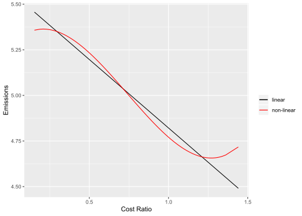<!-- -->

The plot shows us the two regression lines for the linear (`fit`) and non-linear regression (`fit1`). By including the mean-values of `load` in the data frame that we use to predict our fitted values we receive a clear output. Furthermore, the non-linear model seems to reflect the real-world a lot better. Because of technological and capacity restriction it is unlikely that emissions can increase in a linear fashion without restrictions for cost ratios at lower and higher ranges in our bounds.  
Looking closely though, we still see some flaws that don't seem to be accurate. It is unlikely that we observe increasing emissions with higher cost ratios. Obviously this is caused by the type of cubic functions we use and their mathematical behaviour, so moving forward we improve the method of using polynomial function for our model. Click `Go to next exercise` to continue.


***

### Award: Regression Expert I
You performed your first couple and regressions and plotted them according to our method.

***


## Exercise 3.2 -- Restricted Cubic Spline Regressions

In this exercise we will introduce the concepts of `restricted spline regressions`, which are basically a special form of polynomial regressions. In the world of craftman's the term splines would refer to a strip of wood that is being shaped into a smooth curve. The strip is hereby forced around fixed points to form a natural spline. In the world of mathematics these splines are defined as a form of piece-wise polynomial functions, which usually consist of cubic polynomials. `Knots` refer to the fixed points in mathematical splines and are placed along the range of data. As we ajust the number of knots the spline becomes more or less flexible.  


Source: Author  

We can roughly visualize this method with the graph above. Given a range of data, we set a certain amount of `Knots` and in between those ("Segments"), we fit several cubic functions. Combining the cubic function will give us our regression line for the spline regression. Mind here that the amount of Knots has to be chosen with caution, because a wrong amount can lead to over- or underfitting. A way to confirm the correctness of the fit is to conduct robustness tests where we adjust the number of knots. We will do this briefly at the end of this problem set. At last, our model will be `restricted` , meaning that the spline is constrained to be linear in front of the first knot and after the last one. This solves the problem we observed with the polynomial model at the end of last exercise.

**Task:** To start, load the required data. We use the same data and limit them to interconnection `EAST` as before. The data frame already takes these changes into account. Just press *check*.

```r
dat_east <- read_csv("Data/exercise3_2.csv")
```

**Task:** Fit a regression model, which includes `costratio` and `load` as natural splines with `5` degrees of freedom. Use the data frame `dat_east`.  

$$\tag{5}co2mass_{2t}=s(priceratio_{t}|\beta)+s(load_{t}|\theta)+\epsilon_t$$


***

### Info: ns()
`Ns()` is part of the `splines` package and allows us to perform natural splines regressions on our data. It takes several input arguments, the only one we will use is `df`. `Df` hereby defines the degrees of freedom and the function chooses the knots accordingly, which are set at predefined quantiles. In our case we will choose `df=5`, which places our knots at following quantiles: `[0.05, 0.275, 0.5, 0.725, 0.95]` (Harrell, 2001).  
Splines that we create with `ns()` are restricted by definition of the function. A function that doesn't do that is `bs()`.

A simple syntax example of cubic spline regression: 


```r
#build a model that tries to explain the relation between weight and color of bananas
fit = lm(banana_weight ~ ns(banana_color, df=5), data=bananas)
```

For full documentation of the function, conduct the help() function.

***


```r
#fit3 = lm(co2mass ~ ns(___)+ns(___), data=dat_east)
fit3 = lm(co2mass ~ ns(costratio,df = 5)+ns(load, df=5), data=dat_east)
```

**Task:** Use `show.regression()` to get the summary statistics of `fit3`.

```r
show.regression(fit3)
```

```
## 
## ===============================================================
##                                        co2mass                 
##                                          fit3                  
## ---------------------------------------------------------------
## ns(costratio, df = 5)1                  -0.049                 
##                                       t = -1.214               
##                                                                
## ns(costratio, df = 5)2                  -0.198                 
##                                     t = -3.939***              
##                                                                
## ns(costratio, df = 5)3                  -0.611                 
##                                     t = -20.013***             
##                                                                
## ns(costratio, df = 5)4                  -0.648                 
##                                     t = -6.368***              
##                                                                
## ns(costratio, df = 5)5                  -0.749                 
##                                     t = -17.493***             
##                                                                
## ns(load, df = 5)1                       1.045                  
##                                     t = 25.063***              
##                                                                
## ns(load, df = 5)2                       1.422                  
##                                     t = 28.019***              
##                                                                
## ns(load, df = 5)3                       2.227                  
##                                     t = 63.409***              
##                                                                
## ns(load, df = 5)4                       3.691                  
##                                     t = 35.241***              
##                                                                
## ns(load, df = 5)5                       3.549                  
##                                     t = 55.999***              
##                                                                
## Constant                                4.015                  
##                                     t = 63.223***              
##                                                                
## Observations                            2,557                  
## R2                                      0.929                  
## Adjusted R2                             0.929                  
## ---------------------------------------------------------------
## Notes:                 ***Significant at the 0.1 percent level.
##                        **Significant at the 1 percent level.   
##                        *Significant at the 5 percent level.
```

The summary statistics of our spline model is comparable to the simple polynomial regressions from last exercise, where we got a coefficient for every grade of the cubic function. In this case we get a coefficients for every degree of freedom. Since splines are transformations of explanatory variables it isn't really possible to interpret these coefficients straightaway. Nevertheless we want to get clear and interpretable results and that's the reason why we went through the trouble and introduced the methods to plot our models.  

**Task:** Just press *check*.

```r
pred_dat = tibble(costratio = dat_east$costratio) %>%
  cbind(load=mean(dat_east$load))
co2.hat3 = predict(fit3, pred_dat)
ggplot(pred_dat,aes(x=costratio,y=dat_east$co2mass))+
    geom_point(alpha=0.3) + 
    geom_line(aes(x=costratio, y=co2.hat3), color="red") + 
    scale_y_continuous(limits=c(4,6))
```

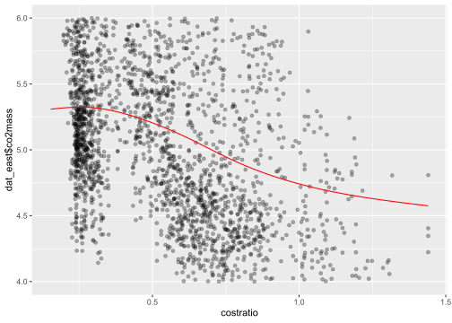<!-- -->

We continue to see a negative relationship between cost ratios and $CO_2$ emissions. Additionally I added the data points of $CO_2$ emissions. As cost ratios increase, the variance between our regression line and the observations tends to increase as well. This is a strong indicator that our model suffers from heteroskedasticity. Since standard error methods rely on the assumption that there's no correlation between the independent variables and the variance of the dependent variables, we shouldn't use them but instead calculate `heteroskedasticity robust standard errors`.  
R packages normally provide a lot of handy functions to predict fitted values and calculate robust standard errors at the same time (e.g. `lmrobust` from package `estimatr`). However, we don't predict our fitted values on the same data frame we build our model on. Therefore, I wrote a custom function that allows us to predict our fitted values and at the same time provides the Newey-West estimators, which is already implemented in the `sandwich` package. The function will calculate the robust errors based on our requirement and adds 95% confidence intervals to our data frame. For reference I included the function below, however we won't go through the theory of Newey-West-estimators or explain the function.  


***

### Info: Custom Function


```r
predict.robust <- function(m, data, data_p) {
  require(sandwich)
    
  reg_temp <- lm(co2mass ~ ns(costratio, df=5), data=data)
  pred_df <- data.frame(fit=predict(m, newdata=data_p))
  
  # get HAV VCOV matrix, equal to NewwayWest()
  robust_errors <- vcovHC(reg_temp, type = "HC2")
  # get model matrix
  mat <- model.matrix(reg_temp)
  # point-wise variance for prediction
  var_fit_hac <- rowSums((mat %*% robust_errors) * mat)
  # standard errors
  se_fit_hac = sqrt(var_fit_hac)
  
  pred_df_data <- pred_df %>%
    mutate(
      # calculate CI intervals
      lwr = pred_df$fit - qt(0.975, df=m$df.residual)*se_fit_hac,
      upr = pred_df$fit + qt(0.975, df=m$df.residual)*se_fit_hac
    )
}
```


***


We are now at a point where we have made all the necessary assumptions. Click `Go to next exercise` to start with our main analysis.


***

### Award: Regression Expert II
You successfully performed your first spline regression.

***


## Exercise 4 -- Examining Carbon Abatement

In the following chapter we shift our focus away from theory and work our way towards our final results. To approach our main analysis we split it into two parts:

- First, we determine the $CO_2$ emission response curves to changing fuel costs. To reflect the behaviour of the energy market as closely as possible we will add additional factors to our model, which will be based on the methods we introduced in the previous exericise. (`Exercise 4.1`)

- Afterwards, based on the theory of `Exercise 2`, we transform our fuel costs into carbon prices and discuss the final results. (`Exercise 4.2`)

In Chapter 3 we worked our way towards a fitting model and ended up with spline regressions. To keep it simple we limited our data to fuel costs and generated electricity (`load`). The goal of this exercise is to introduce the additional factors we want to include in our model and get a final impression of the data. 

**Task:** Load the data set `exercise4.csv` with `read_csv` and store it into a variable called `dat`.


```r
#___ <- ___("./Data/___")
dat <- read_csv("./Data/exercise4.csv")
```
&nbsp;
The data frame is a combination of data we used before and adds several factors. The data continue to be aggregated to a daily level and seperated by interconnections. New variables are explained below:

`tlsd`, `tlmin`, `tlmax`: Standard deviation, minimum and maximum of `load`  
`meant`: Average daily temperature  
`nonFossil`: Electricity generated with non-fossil fuel in MWh  
`so2price`: Permit prices of $SO_2$ ($/ton)  
`netNSflow`: Electricity imports from Canada to the U.S. in MWh  

The U.S. Energy Information Administration (EIA) provides data for `non-fossil` energy production, permit prices for $SO_2$ are collected from the `EPA Clean Air Markets` and `net imports` of electricity from Canada are gathered from the `National Energy Board of Canada`. You can find links to the data in the `References` section.  
Another factor we haven't considered yet is the seasonal component in energy consumption. We already mentioned in `Exercise 1`, that load heavily varies during the year with a smaller peak in summer and a bigger one in winter. To adjust for this effect we create a dummy variable that controls for years and seasons (off-season/summer/winter). 

**Task:** Calculate the seasonal dummy variable and show the first few rows. Just press *check*.

```r
dat_final <- dat %>% 
        mutate(season=(month>3) + (month>6) + (month>9),
                       yearseason=year*10+season)

head(dat_final,3)
```

```
##       date month year intercn   co2mass coalprice gasprice costratio
## 1 1/1/2006     1 2006    EAST 4548660.4   2.05989  9.34131   0.22051
## 2 1/1/2006     1 2006   ERCOT  452107.9   1.66738  7.58753   0.21975
## 3 1/1/2006     1 2006    WECC  775122.7   1.62992  7.81944   0.20844
##        load      tlsd     tlmin     tlmax nonfossil    meant netNSflow
## 1 6454708.0 18396.854 241122.34 302880.47  75239808 41.66000   2618123
## 2  616973.4  2818.439  21748.79  30423.37   4278971 63.46470         0
## 3 1587397.1  6752.520  56996.01  78514.23  26915852 46.78953  -1170264
##   so2price season yearseason
## 1  1513.86      0      20060
## 2  1513.86      0      20060
## 3  1513.86      0      20060
```

The data frame includes all variables we use for our main analysis. We already got a glimpse on some variables earlier. Now that we have our complete data frame we will create a summary table which will give us an nice overview of important key data, seperated by interconnections. That way we can draw some conclusions for later interpretations.  

**Task:** We use `group_by()` to group the dataset `dat` by `intercn`. Afterwards, run `summarise_all()` to calculate the means of every column. For formatting we use the `kable`. Just press *check*.


***

### Info: Group_by() and summarise()
`Group_by()` allows us to group a data frame by specific variables. Operations that are run on the grouped data frame are then performed on each group.  

The function `Summarise()` runs on *grouped data* and can perform operations e.g. calculating means (`mean()`) or finding minimums (`min()`). There are several
pre-implemented version of `summarise` functions in `R`. The one we use here is `summarise_all()`, which performs these operations on all columns.

To give you an example in code form, lets pretend we have a dataframe `data` with several `car manufacturer`, their respective car models with `prices` and we want to calculate the average car price per manufacturer:


```r
example <- data %>% 
  group_by(manufacturer) %>%
  summarise(mean_price = mean(price))
```

If you need more information, call `help(group_by)` or `help(summarize)`.

***

  

***

### Info: kable()
The package `kableExtra` and in particular the function `kable()` provides us with a framework to build complex LaTeX tables and enables us to manipulate the table styles by adding html/css elements. It supports the use of the pipe function `%>%` and works quite similar to `ggplot` by allowing us to add layers to our tables.

You can find detailed information on the functionalities [here](http://haozhu233.github.io/kableExtra/awesome_table_in_pdf.pdf).

***


**Task:** Just press **check**.

```r
dat_final %>% 
  select(intercn, co2mass, load, coalprice, gasprice, costratio, nonfossil) %>% 
  group_by(intercn) %>% 
  mutate(co2mass = co2mass/1000, load=load/1000, "Emission Rate"=co2mass/load, nonfossil=nonfossil/100000) %>% 
  summarise_all("mean") %>% 
  kable(format="html", align="c", col.names = c("intercn","Emissions","Load","Gas Cost","Coal Cost","Cost Ratio","Non Fossil","Emission Rate")) %>%
  kable_styling(bootstrap_options = c("striped", "hover", "condensed"), position = "center", full_width = F)
```

<table class="table table-striped table-hover table-condensed" style="width: auto !important; margin-left: auto; margin-right: auto;">
 <thead>
  <tr>
   <th style="text-align:center;"> intercn </th>
   <th style="text-align:center;"> Emissions </th>
   <th style="text-align:center;"> Load </th>
   <th style="text-align:center;"> Gas Cost </th>
   <th style="text-align:center;"> Coal Cost </th>
   <th style="text-align:center;"> Cost Ratio </th>
   <th style="text-align:center;"> Non Fossil </th>
   <th style="text-align:center;"> Emission Rate </th>
  </tr>
 </thead>
<tbody>
  <tr>
   <td style="text-align:center;"> EAST </td>
   <td style="text-align:center;"> 5159.0120 </td>
   <td style="text-align:center;"> 7456.084 </td>
   <td style="text-align:center;"> 2.499007 </td>
   <td style="text-align:center;"> 5.487308 </td>
   <td style="text-align:center;"> 0.5499861 </td>
   <td style="text-align:center;"> 704.27030 </td>
   <td style="text-align:center;"> 0.6901824 </td>
  </tr>
  <tr>
   <td style="text-align:center;"> ERCOT </td>
   <td style="text-align:center;"> 561.4024 </td>
   <td style="text-align:center;"> 866.491 </td>
   <td style="text-align:center;"> 2.204418 </td>
   <td style="text-align:center;"> 5.104193 </td>
   <td style="text-align:center;"> 0.5243940 </td>
   <td style="text-align:center;"> 50.71451 </td>
   <td style="text-align:center;"> 0.6502459 </td>
  </tr>
  <tr>
   <td style="text-align:center;"> WECC </td>
   <td style="text-align:center;"> 888.6862 </td>
   <td style="text-align:center;"> 1834.824 </td>
   <td style="text-align:center;"> 1.841604 </td>
   <td style="text-align:center;"> 5.042629 </td>
   <td style="text-align:center;"> 0.4303330 </td>
   <td style="text-align:center;"> 249.70453 </td>
   <td style="text-align:center;"> 0.4838995 </td>
  </tr>
</tbody>
</table>

The table reports the means of important variables for each interconnection. We can clearly see that `EAST` is by far the largest of the observed energy markets in terms of emissions, load and non-fossil power generation. The emissions seem to increase proportionally to the electricity consumption for all interconnections if we take the electricity production from non-fossil sources in consideration. This gets clearer if the look at the emission rates, which is defined as $ER=\frac{emissions}{load}$. The `Western` Interconnection hereby has by far the `greenest` energy production, followed with some distance by Texas (`ERCOT`) and the `Eastern` interconnection. Furthermore we observe clear variations in cost ratios. These observations are in line with our assumptions from `Exercise 2`, where we stated that each interconnection has vastly different market conditions.

In the next exercise will will use this data frame, in combination with the theory of `Chapter 3` to trace out the emission response curves. Click `Go to next exercise` to continue.


***

### Award: Data Expert
You gathered all required data for our analysis.

***


## Exercise 4.1 -- Estimated CO2 Response to Fuel Prices

In this exercise we will finally bring together all of our expertise and focus on our main results. In the first step we will perform the regression model based on the implications we made in `Exercise 3.2`. Afterwards we will use this model to predict $CO_2$ emissions and trace out the emission response curves to changing fuel prices. We will explain and carry out the analysis step by step for interconnection `EAST`, afterwards apply it to `ERCOT` and `WECC` and interpret our results.  
As a side note, we will dive through a bunch of code. It isn't meant to be the shortest or the most efficient, but should allow you to follow each step closely.  
  
As always, we start the exercise by importing our data, following that we filter for interconnection `EAST`. Afterwards, we create a new data frame with the mean values of the independent variables as shown in `Exercise 3.1`. Since these steps are pretty straight forward and we have seen the methods before, go ahead and prepare our data.

**Task:** Load the dataframe and store it in `dat`. Just press *check*.

```r
dat <- read_csv("Data/exercise4_1.csv")
head(dat,3)
```

```
##       date month year intercn   co2mass coalprice gasprice costratio
## 1 1/1/2006     1 2006    EAST 4548660.4   2.05989  9.34131   0.22051
## 2 1/1/2006     1 2006   ERCOT  452107.9   1.66738  7.58753   0.21975
## 3 1/1/2006     1 2006    WECC  775122.7   1.62992  7.81944   0.20844
##        load      tlsd     tlmin     tlmax nonfossil    meant netNSflow
## 1 6454708.0 18396.854 241122.34 302880.47  75239808 41.66000   2618123
## 2  616973.4  2818.439  21748.79  30423.37   4278971 63.46470         0
## 3 1587397.1  6752.520  56996.01  78514.23  26915852 46.78953  -1170264
##   so2price season yearseason
## 1  1513.86      0      20060
## 2  1513.86      0      20060
## 3  1513.86      0      20060
```

**Task:** Filter the data set `dat` for intercn `EAST` and store it in `east`.

```r
east <- filter(dat, intercn=="EAST")
```

**Task:** Calculate the `mean` of the independent variable of our regression model. First, we `select()` the necessary columns and then use `summarise_all()` to calculate the means. Store the result in `mean_east`.

```r
# ___ <- east %>% 
#  select(load, tlsd, tlmin, tlmax, meant, nonfossil, so2price, netNSflow, yearseason) %>% 
#  summarise_all(___)
mean_east <- east %>% 
  select(load, tlsd, tlmin, tlmax, meant, nonfossil, so2price, netNSflow, yearseason) %>% 
  summarise_all(mean)
```

**Task:** To make our life a bit easier we merge the data of mean values with other relevant variables. We could skip this step but would be forced to work with several data frames later on. Just press *check*.

```r
predict_east <- tibble(date=east$date, intercn=east$intercn, gasprice = east$gasprice, coalprice=east$coalprice, costratio = east$costratio) %>% 
  cbind(mean_east)
```


***

### Award: Master of Preparation
You successfully applied the methods we introduced to prepare data for analysis! Keep going.

***


The data preparation is done, now we can define our model. We will perform a restricted spline regression, which expands the model in `Exercise 3.2`. The complete model is proposed by Cullen and is defined below. We construct splines for `costratio`, `load`  and `meant` and include the remaining control variables as well as the seasonal dummy variable in a linear form.

$$\tag{5}co2mass_{2t}=s(costratio_{t}|\beta)+s(load_{t}|\theta) + s(meant_t|\omega)+X_t\psi+D_\gamma+\epsilon_t$$


***

### Info: Model variables
We already introduced the meaning of some variables in previous exercises. To get one complete view I listed them below again:  
$co2mass_{2t}$: CO2 emissions in tons  
$costratio_{t}$: Cost ratio of coal over gas
$load_{t}$: daily electricity consumption per interconnection in MWh  
$meant_{t}$: average daily temperature per interconnection  
$X_{t}$: Non-fossil power generation (e.g. solar, hydro or wind), $SO_{2}$ prices, net imports of electricity import from Canada and variance in load  
$D_\gamma$: Dummy variable for seasonal variation to absorb fluctuations

***


**Task:** Since we will run this regression model one times each for every interconnection, we can save some work and pre-define our model as a variable. Define the model according to `Equation 5` and store it as `model`.

```r
#___ co2mass ~ ___(priceratio, df=...) + ___(load, df=...) + tlsd + tlmin + tlmax + ___(meant, df=___) + nonfossil + so2price + netNSflow + yearseason
model=co2mass ~ ns(costratio, df=5) + ns(load, df=5) + tlsd + tlmin + tlmax + ns(meant, df=5) + nonfossil + so2price + netNSflow + yearseason
```

**Task:** Perform the regression of `model`. Use `lm()` and the data frame `east`.

```r
reg_east <- lm(model, data=east)
```

We mentioned this before, but because of the fact that the spline coefficients are transformations of explanatory variables, we forego looking at the summary statistics. Instead we continue with our workflow. In the next step we predict the fitted values. To do this we follow our method of `Exercise 3.2` and use our custom funtion `predict.robust()`, which combines `predict()` and evaluates the `confidence intervals` from robust errors.  

**Task:** Just press *check*.


***

### Info: Confidence interval
A confidence interval answers the question for which defined probability the data points lie within the interval. Mathematically, given we have observations $x_1...x_n$ and a confidence level $\gamma$, a confidence interval has a probability $\gamma$ to contain the true underlying parameter. Most commonly, and also in our case, we use
the 95% confidence interval and is defined as: 

$$\hat{y} ± t_{\alpha/2,n-2} \sqrt{MSE \frac{1}{n}+\frac{(x_k-\overline{x})^2}{\sum x_i-\overline{x}^2)}}$$
where $\hat{\gamma}$ is the fitted response, $t_{\alpha/2,n-2}$ the t-value with n-2 degrees of freedom and the equation inside the square root represents the standard error.

***


```r
fit_east <- predict_east %>% 
  cbind(predict.robust(reg_east, east, predict_east))
```

At this point we are able to plot our results. As seen before we would visualize the relation between the absolute values of fitted $CO_2$ emissions and the range of cost ratios. This was an elegant way to introduce our model, but our final results should give us an clearer view. Since cost ratios can be constructed with a variety of different levels of coal and gas costs, it is unclear which specific prices of gas would imply certain changes in emissions. To avoid confusion we can simply transform our cost ratios backwards and only include decreasing costs of natural gas.  
Secondly, we will transform emission from a absolute scale to show the relative change in relation to a base line. Meaning, we show the relative change in emissions in realtion to predicted fuel costs for 2025, as introduced in `Exercise 2`.  

**Task:** Below I implimented the changes from above and commented each step. We can tranform cost ratios directly in the process of creating our plot in the following code chunk. Just press *check*.  

```r
# define base prices as introduced in Exercise 2
basecoal=2.25
basegas=5.75

# calculate the differences between cost ratios and the predicted cost ratio of 2025
diff_base <- abs(east$costratio - (basecoal/basegas))
# find the smallest value of difference
min_dif <- min(diff_base)
# return TRUE for the smallest difference in diff_base
closest <- min_dif==diff_base
# find the value of fitted emissions that is closest
base_emit <- mean(fit_east$fit[which(closest)])

# transform absolute fitted emissions into percentage change to baseline (also for CI's)
final_east <- fit_east %>% 
  mutate(fit.transformed=fit/base_emit-1,
         lwr.transformed=lwr/base_emit-1,
         upr.transformed=upr/base_emit-1)
```

**Task:** The only thing left is to create our plot. Just press *check*.

```r
# transform costratio backwards to plot gas costs, save plot to variable for later use
plot_east <- ggplot(final_east, aes(x=basecoal/east$costratio, y=fit.transformed)) +
  #use geom_ribbon() to add a confidence interval
  geom_ribbon(aes_string(ymin = final_east$lwr.transformed, ymax = final_east$upr.transformed),
                   colour="lightgrey", fill="lightgrey", alpha=0.5,) +
  # add line for fitted emission values
  geom_line(aes(y=fit.transformed)) +
  # transform y-Axis to a percentage scale and set range
  scale_y_continuous(labels = scales::percent_format(accuracy = 1), limits=c(-.15,.05)) +
  # add indication line for baseline gas price
  geom_vline(xintercept = 5.75, linetype = "dashed") + 
  # set scale and range of x-Axis
  scale_x_continuous(breaks=c(2,3,4,5,6,7,8,9,10,11,12), limits=c(2.2, 12)) +
  # add labels 
  labs(title="Eastern Interconnection", subtitle = "y=Percentage Change in CO2 emissions",
       y="", x="Gas Costs $/MMBTU") +
  # set theme (optional)
  theme_minimal()

plot_east
```

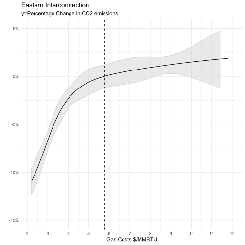<!-- -->

The plot shows us the relative change of $CO_2$ emissions when considering base line natural gas costs of \$5.75. The grey area around the fitted values show us the 95% confidence interval using robust standard errors. Especially for natural gas prices lower than \$4 we can force a switch to cleaner plants, which leads up to roughly 12% reduced emissions. On the other side we observe a small increase in emissions with increasing gas costs. This is basically the opposite fuel-switching we intend. With higher gas costs the marginal costs of coal generators become favorable in relation to gas-generators. Although we have to be a bit more careful about these result. Since we plot our confidence intervals and already analysed the distribution of our data we know that the majority of our data are within a cost range of around \$2 and \$9. Therefore our errors include a larger interval with higher costs.  
Going forward we run the code for the other two interconncection. If you feel confident you can create your own plots based on our data and methods. otherwise just run the two code chunks below.  

**Task:** Run the code for the `ERCOT` interconnection. Just press *check*.

```r
#filter for interconnection ERCOT
ercot <- filter(dat, intercn=="ERCOT")
#calculate the mean for regression coefficients
mean_ercot <- ercot %>% 
  select(load, tlsd, tlmin, tlmax, meant, nonfossil, so2price, netNSflow, yearseason) %>% 
  summarise_all(mean)
#join data
predict_ercot <- tibble(date=ercot$date, intercn=ercot$intercn, gasprice = ercot$gasprice, coalprice=ercot$coalprice, costratio = ercot$costratio) %>% cbind(mean_ercot)
#run model 
reg_ercot <- lm(model, data=ercot)
#predict fitted co2 emission and join with predict_ercot, ERCOT has no net imports of electricity, predict throws warning
fit_ercot <- predict_ercot %>% 
  cbind(predict.robust(reg_ercot, ercot, predict_ercot))
#find baselevel of emission in relation to baseline price of coal and gas
diff_base <- abs(ercot$costratio - (basecoal/basegas))
min_dif <- min(diff_base)
closest <- min_dif==diff_base
base_emit <- mean(fit_ercot$fit[which(closest)])
#transform predicted emission into percentage change to baseline emissions
final_ercot <- fit_ercot %>% 
  mutate(fit.transformed=fit/base_emit-1,
         lwr.transformed=lwr/base_emit-1,
         upr.transformed=upr/base_emit-1)
#plot result
plot_ercot <- ggplot(final_ercot, aes(x=basecoal/costratio, y=fit.transformed)) +
  geom_ribbon(aes_string(ymin = final_ercot$lwr.transformed, ymax = final_ercot$upr.transformed),
                   colour="lightgrey", fill="lightgrey", alpha=0.5) +
  geom_line(aes(y=fit.transformed)) +
  scale_y_continuous(labels = scales::percent_format(accuracy = 1), limits=c(-.15,.05)) +
  geom_vline(xintercept = 5.75, linetype = "dashed") + 
  scale_x_continuous(breaks=c(2,3,4,5,6,7,8,9,10,11,12), limits=c(2.2, 12)) +
  labs(title="ERCOT Interconnection", subtitle = "y=Percentage Change in CO2 emissions",
       y="", x="Gas Costs $/MMBTU") +
  theme_minimal()
```

**Task:** Run the code for the `WECC` interconnection. Just press *check*.

```r
#filter for interconnection WECC
wecc <- filter(dat, intercn=="WECC")
#calculate the mean for regression coefficients
mean_wecc <- wecc %>% 
  select(load, tlsd, tlmin, tlmax, meant, nonfossil, so2price, netNSflow, yearseason) %>% 
  summarise_all(mean)
#join data
predict_wecc <- tibble(date=wecc$date, intercn=wecc$intercn, gasprice = wecc$gasprice, coalprice=wecc$coalprice, costratio = wecc$costratio) %>% cbind(mean_wecc)
#run model 
reg_wecc <- lm(model, data=wecc)
#predict fitted co2 emission and join with predict_wecc
fit_wecc <- predict_wecc %>% 
  cbind(predict.robust(reg_wecc, wecc, predict_wecc))
#find baselevel of emission in relation to baseline price of coal and gas
diff_base <- abs(wecc$costratio - (basecoal/basegas))
min_dif <- min(diff_base)
closest <- min_dif==diff_base
base_emit <- mean(fit_wecc$fit[which(closest)])
#transform predicted emission into percentage change to baseline emissions
final_wecc <- fit_wecc %>% 
  mutate(fit.transformed=fit/base_emit-1,
         lwr.transformed=lwr/base_emit-1,
         upr.transformed=upr/base_emit-1)
#plot result
plot_wecc <- ggplot(final_wecc, aes(x=basecoal/costratio, y=fit.transformed)) +
  geom_ribbon(aes_string(ymin = final_wecc$lwr.transformed, ymax = final_wecc$upr.transformed),
                   colour="lightgrey", fill="lightgrey", alpha=0.5) +
  geom_line(aes(y=fit.transformed)) +
  scale_y_continuous(labels = scales::percent_format(accuracy = 1), limits=c(-.15,.05)) +
  geom_vline(xintercept = 5.75, linetype = "dashed") + 
  scale_x_continuous(breaks=c(2,3,4,5,6,7,8,9,10,11,12), limits=c(2.2, 12)) +
  labs(title="Western Interconnection", subtitle = "y=Percentage Change in CO2 emissions",
       y="", x="Gas Costs $/MMBTU") +
  theme_minimal()
```

**Task:** Use grid.arrange() to display the plots next to each other. Just press *check*.


```r
grid.arrange(plot_east, plot_ercot, plot_wecc,  nrow=1)
```

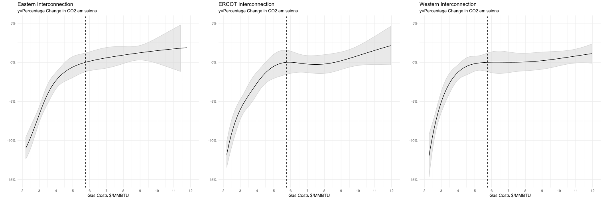<!-- -->

At first glance and by comparing the results we get comprarable response curves for all interconnections. We can achieve reductions in $CO_2$ emissions of roughly 12% when introducing gas costs of $2. We also observe increasing emissions for costs that are higher than our baseline (we explained the reason before). Although by looking closely we can detect some differences.  
For the Texas Interconnection (`ERCOT`) the fall in emissions starts with lower gas costs and happens slightly stronger. If we look at the summary table of `Exercise 4` we can come up with some explanations. The proportion of non-fossil generated power is way lower in Texas than in other regions. This results in strong dependencies to the generators that are available at that moment. Fuel-switching will thereby occur later, but when the economic pressure is high enough, more strongly. We observe the same effect for increasing gas prices. The marginal costs for coal generators and other energy sources become more favorable with higher gas costs.  
The respone curve of the `Western Interconnection` in contrast reacts much smoother to changing gas costs. Because of the higher proportion of non-fossil power generation of roughly 30%, the region is less effected by fuel-switching in the short term. The curve responds very static over a wider range of gas costs without significant changes in emissions. Additionally, for higher gas price the increase in emissions is clearly lower than for other regions. On the other side the grid has a longer response time to react to falling gas prices. All of these point are also supported by the fact, that the emission rate of the Western Interconnection is about 25% lower. Overall we can conclude that simply by comparing the different regions, the Western Interconnections seems to be set best for the future, because changing gas costs hardly effect their fuel-switching.  
  
Nevertheless, gas prices are set by supply and demand and without introducing very specific instruments to influence the industry, it's hard to directly set pricing as a decisive institution. In the next exercise we will solve this problem by tranforming our fuel costs into carbon prices and conclude our analysis. Click `Go to next exercise` to continue.


***

### Award: Sp(l)ine Surgeon
Congratulation. You made it through this though exercise. Keep going, the hardest part is over.

***


## Exercise 4.2 --  Imputed CO2 Response to Carbon Prices

In the previous exercise we plotted the effect of changing cost ratios of `coal` and `gas` against the fitted values of $CO_2$ emissions. What we are really interested though, is the effect of carbon prices on emissions. Therefore we introduced a way to transform our cost ratios in carbon taxes in `Exercise 2`. This will allow us to directly determine the effects as well as the costs of such a tax. The plan of this exercise is as followed, first we transform our cost ratios according to `Equation 3` and afterwards plot our results similiar to `Exercise 4.1`. 

We continue to use the same fixed and predicted fuel prices for 2025 to determine the baseline level of emissions. Additionally we need the carbon contents of both fuel types. We introduced the values of carbon content in `Exercise 2`, for reference I include them once more:  

- Carbon content `Natural Gas`: 117 lbs carbon/MMBTU or `0.0585 tons/MMBTU`
- Carbon content `Coal`: 210.8 lbs carbon/MMBTU or `0.1054 tons/MMBTU` (averaged on weighted fuel consumption according to EIA Form 923)  

To avoid repeating the same steps as in the last exercise, I prepared a data frame that includes the data of all interconnections with `predicted emissions`, `tranformed emissions` and `confidence intervals` from the previous exercise. We load the data set and store it as `dat`. We also declare the variables for `baseline costs` and `carbon content`.

**Task:** Just press *check*.

```r
dat <- read_csv("Data/exercise4_2.csv")

head(dat,3)
```

```
##       date intercn costratio       fit       lwr       upr fit.transformed
## 1 1/1/2006    EAST   0.22051 5103749.0 5012832.2 5194665.7         0.01544
## 2 1/1/2006   ERCOT   0.21975  587032.3  579152.8  594911.8         0.01015
## 3 1/1/2006    WECC   0.20844  880353.8  872760.3  887947.3         0.00741
##   lwr.transformed upr.transformed
## 1        -0.00265         0.03353
## 2        -0.00341         0.02370
## 3        -0.00128         0.01609
```

```r
basegas <- 5.75
basecoal <- 2.25
co2_coal <- 0.0585
co2_gas <- 0.1054
```

In the next step we want to transform our cost ratios using `Equation 3` (see below). Since we have all data available for the equation we can just go ahead and perform the calculation.  

$$\tag{3}{P_{co2}}=\frac{CR\cdot{base_{gas}}-{base_{coal}}}{CO_{2,coal}-CR\cdot CO_{2,gas}}$$

**Task:** Create a new column `carbontax` using `Equation 3`. Store the resulting data frame as `dat_tax`.

```r
#___ <- dat %>% 
#  mutate(carbontax = (costratio*___-___)/(___-costratio*___)) %>% 
#
#head(___,___)
dat_tax <- dat %>% 
  mutate(carbontax = (costratio*basegas-basecoal)/(co2_gas-costratio*co2_coal))
```

**Task:** Use `range()` to get the minimum and maximum of `carbontax`.

```r
range(dat_tax$carbontax)
```

```
## [1] -14.64738 285.24085
```

As you can see we calculated negative as well as very high values of carbon taxes. Negative values wouldn't make much sense to consider for a tax in our case. The same is true for values that are extremely high. Because of that we will limit our taxes to a range of $[0,80]$. Note that we will drop around 30% of our data due to carbon prices outside of our bounds.

**Task:** Filter `carbon taxes` according to the data range above and store the data frame into `tax`.

```r
#___ <- dat_tax %>% 
#  filter(carbontax >= ___ & carbontax <= ___)
tax <- dat_tax %>% 
  filter(carbontax >= 0 & carbontax <= 80)
```

The overall approach to plot our results is similiar to the on in Exercise `4.1`. We will filter our data frame for each interconnection and create a plot. However we will plot the response curve of emissions to changing carbon prices. Additionally we will interpret all outputs at once.  

**Task:** Filter the data frame `tax` for interconnection `EAST` and save it to `tax_east`. Since we filter for a string, don't forget to put quotes around the argument.

```r
tax_east <- filter(tax, intercn=="EAST")
```

**Task:** Just press *check*.

```r
#run for Interconnection EAST
plot_east <- ggplot(tax_east, aes(x=carbontax, y=fit.transformed)) +
  geom_ribbon(aes_string(ymin = tax_east$lwr.transformed, ymax = tax_east$upr.transformed),
                   colour="lightgrey", fill="lightgrey", alpha=0.5) +
  geom_line(aes(y=fit.transformed)) +
  scale_y_continuous(labels = scales::percent_format(accuracy = 1), limits=c(-0.15,.01)) +
  scale_x_continuous(limits=c(0, 80)) +
  labs(title="Eastern Interconnection",
       y="", x="Carbon Price $/ton", subtitle="y=CO2 emissions in Percentage") 

#run for Interconnection ERCOT
tax_ercot <- filter(tax, intercn=="ERCOT")

plot_ercot <- ggplot(tax_ercot, aes(x=carbontax, y=fit.transformed)) +
  geom_ribbon(aes_string(ymin = tax_ercot$lwr.transformed, ymax = tax_ercot$upr.transformed),
                   colour="lightgrey", fill="lightgrey", alpha=0.5) +
  geom_line(aes(y=fit.transformed)) +  
  scale_y_continuous(labels = scales::percent_format(accuracy = 1), limits=c(-0.15,.01)) +
  scale_x_continuous(limits=c(0, 80)) +
  labs(title="Ercot Interconnection",
       y="", x="Carbon Price $/ton", subtitle="y=CO2 emissions in Percentage") 

# run for Interconnection WECC
tax_wecc <- filter(tax, intercn=="WECC")

plot_wecc <- ggplot(tax_wecc, aes(x=carbontax, y=fit.transformed)) +
  geom_ribbon(aes_string(ymin = tax_wecc$lwr.transformed, ymax = tax_wecc$upr.transformed),
                   colour="lightgrey", fill="lightgrey", alpha=0.5) +
  geom_line(aes(y=fit.transformed)) +
  scale_y_continuous(labels = scales::percent_format(accuracy = 1), limits=c(-0.15,.01)) +
  scale_x_continuous(limits=c(0, 80)) +
  labs(title="Western Interconnection",
       y="", x="Carbon Price $/ton", subtitle="y=CO2 emissions in Percentage") 
```

**Task:** Just press *check*.

```r
grid.arrange(plot_east, plot_ercot, plot_wecc, nrow=1)
```

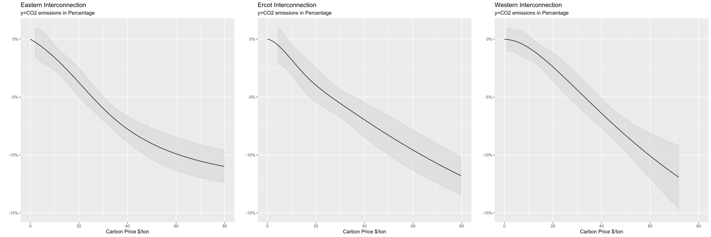<!-- -->

As mentioned before, setting fuel prices directly is hardly possible. Therefore the plots above correspond to positive carbon prices within a reasonable range. In counterpart to our previous view on fuel costs, we lose some depth in the movement of the curves, but we are also able to directly interpret the effects of an viable instrument in form of taxes.  
Since our method only transforms the x-Axis of our plots, the reaction curves look quite similiar and therefore the reasons for reactions of each region are also the same. The central point we can observe here, are the levels of carbon prices that would be most effective in terms of value per dollar.  
Based on the results of our plots, we can achieve clear reductions in emissions by introducing even smaller tax rates. If we purely consider the positive effects of reduced emissions on the environment, we would introduce the highest possible tax rate. But since we are living in a economy where every additional financial burden can have severe consequences we have to carefully weigh our actions.  Based on the graphical interpretation, a tax between \$10 and \$40 seems to have the most impact on $CO_2$ emissions when considering the value per dollar.

&nbsp;

Quiz: Assume we introduce a carbon tax of $50/ton, roughly how much would that cost us in billion dollars?

- 1 [ ]

- 10 [ ]

- 50 [ ]

- 100 [x]

- 200 [ ]


&nbsp;  

You see, even "moderate" tax rates can lead to extreme costs. Considering that the economic effect of carbon prices is controversal, we have to find a socially acceptable level. Therefore, we will construct a table which gives us information on the effects of certain levels of taxes on emissions and at the same time calculate the corresponding costs.

**Task:** Just press *check*.

```r
#define a function to find the value of emissions that is closest to the level of carbon taxes 
find_closest_value <- function(a) {
  vector <- 1:9
  for(i in 0:8){
   vector[i+1] = mean(a$fit[which.min(abs(a$carbontax - i*10))])
  }
  return(vector)
}
#create a new data frame with tax levels from 0 to 80 in steps of 10 and emissions of each interconnection
temp1 = data.frame(tax=seq(0,80,10),east_emission=round(find_closest_value(tax_east)/100000,1), ercot_emission=round(find_closest_value(tax_ercot)/100000,1), wecc_emission=round(find_closest_value(tax_wecc)/100000,1))

#caluclate the percentage change to our baseline level of emissions, additionally sum emissions to get total value of emissions
temp2 <- temp1 %>% 
  mutate(perc_east=round((1-temp1$east_emission/temp1$east_emission[1])*100,1),
         perc_ercot=round((1-temp1$ercot_emission/temp1$ercot_emission[1])*100,1),
         perc_wecc=round((1-temp1$wecc_emission/temp1$wecc_emission[1])*100,1),
         emission_all=east_emission+ercot_emission+wecc_emission)

#calculate the percentage change of total emissions and add total costs of emissions in bn$/year
temp3 <- temp2 %>% 
  mutate(perc_all=round((1-temp2$emission_all/temp2$emission[1])*100,1),
         total_costs=round(temp2$tax*temp2$emission_all/10000*365,1))

#use kable to create a table and change styling accordingly
table <- temp3 %>%
  select(c(1,2,5,3,6,4,7,8,9,10)) %>%
  kable(format="html", col.names = c("Tax","abs.","%","abs.","%","abs.","%","abs.","%", "bn$/year"), align="c", caption = "Precited Emissions and Percentage Abatement") %>%
  add_header_above(c(" "=1, "East" = 2, "ERCOT" = 2, "West" = 2, "Total" = 3)) %>%
  kable_styling(bootstrap_options = c("striped", "hover", "condensed"), position = "center", full_width = F)%>%
  #column_spec(1:9, width = "0.4") %>%
  footnote(general = "Predicted emission are in 100.000 tons/day. Change to baseline (Tax=0).")

table
```

<table class="table table-striped table-hover table-condensed" style="width: auto !important; margin-left: auto; margin-right: auto;">
<caption>Precited Emissions and Percentage Abatement</caption>
 <thead>
<tr>
<th style="border-bottom:hidden" colspan="1"></th>
<th style="border-bottom:hidden; padding-bottom:0; padding-left:3px;padding-right:3px;text-align: center; " colspan="2"><div style="border-bottom: 1px solid #ddd; padding-bottom: 5px; ">East</div></th>
<th style="border-bottom:hidden; padding-bottom:0; padding-left:3px;padding-right:3px;text-align: center; " colspan="2"><div style="border-bottom: 1px solid #ddd; padding-bottom: 5px; ">ERCOT</div></th>
<th style="border-bottom:hidden; padding-bottom:0; padding-left:3px;padding-right:3px;text-align: center; " colspan="2"><div style="border-bottom: 1px solid #ddd; padding-bottom: 5px; ">West</div></th>
<th style="border-bottom:hidden; padding-bottom:0; padding-left:3px;padding-right:3px;text-align: center; " colspan="3"><div style="border-bottom: 1px solid #ddd; padding-bottom: 5px; ">Total</div></th>
</tr>
  <tr>
   <th style="text-align:center;"> Tax </th>
   <th style="text-align:center;"> abs. </th>
   <th style="text-align:center;"> % </th>
   <th style="text-align:center;"> abs. </th>
   <th style="text-align:center;"> % </th>
   <th style="text-align:center;"> abs. </th>
   <th style="text-align:center;"> % </th>
   <th style="text-align:center;"> abs. </th>
   <th style="text-align:center;"> % </th>
   <th style="text-align:center;"> bn$/year </th>
  </tr>
 </thead>
<tbody>
  <tr>
   <td style="text-align:center;"> 0 </td>
   <td style="text-align:center;"> 50.3 </td>
   <td style="text-align:center;"> 0.0 </td>
   <td style="text-align:center;"> 5.8 </td>
   <td style="text-align:center;"> 0.0 </td>
   <td style="text-align:center;"> 8.7 </td>
   <td style="text-align:center;"> 0.0 </td>
   <td style="text-align:center;"> 64.8 </td>
   <td style="text-align:center;"> 0.0 </td>
   <td style="text-align:center;"> 0.0 </td>
  </tr>
  <tr>
   <td style="text-align:center;"> 10 </td>
   <td style="text-align:center;"> 49.5 </td>
   <td style="text-align:center;"> 1.6 </td>
   <td style="text-align:center;"> 5.7 </td>
   <td style="text-align:center;"> 1.7 </td>
   <td style="text-align:center;"> 8.7 </td>
   <td style="text-align:center;"> 0.0 </td>
   <td style="text-align:center;"> 63.9 </td>
   <td style="text-align:center;"> 1.4 </td>
   <td style="text-align:center;"> 23.3 </td>
  </tr>
  <tr>
   <td style="text-align:center;"> 20 </td>
   <td style="text-align:center;"> 48.4 </td>
   <td style="text-align:center;"> 3.8 </td>
   <td style="text-align:center;"> 5.6 </td>
   <td style="text-align:center;"> 3.4 </td>
   <td style="text-align:center;"> 8.5 </td>
   <td style="text-align:center;"> 2.3 </td>
   <td style="text-align:center;"> 62.5 </td>
   <td style="text-align:center;"> 3.5 </td>
   <td style="text-align:center;"> 45.6 </td>
  </tr>
  <tr>
   <td style="text-align:center;"> 30 </td>
   <td style="text-align:center;"> 47.2 </td>
   <td style="text-align:center;"> 6.2 </td>
   <td style="text-align:center;"> 5.5 </td>
   <td style="text-align:center;"> 5.2 </td>
   <td style="text-align:center;"> 8.4 </td>
   <td style="text-align:center;"> 3.4 </td>
   <td style="text-align:center;"> 61.1 </td>
   <td style="text-align:center;"> 5.7 </td>
   <td style="text-align:center;"> 66.9 </td>
  </tr>
  <tr>
   <td style="text-align:center;"> 40 </td>
   <td style="text-align:center;"> 46.4 </td>
   <td style="text-align:center;"> 7.8 </td>
   <td style="text-align:center;"> 5.4 </td>
   <td style="text-align:center;"> 6.9 </td>
   <td style="text-align:center;"> 8.2 </td>
   <td style="text-align:center;"> 5.7 </td>
   <td style="text-align:center;"> 60.0 </td>
   <td style="text-align:center;"> 7.4 </td>
   <td style="text-align:center;"> 87.6 </td>
  </tr>
  <tr>
   <td style="text-align:center;"> 50 </td>
   <td style="text-align:center;"> 45.7 </td>
   <td style="text-align:center;"> 9.1 </td>
   <td style="text-align:center;"> 5.3 </td>
   <td style="text-align:center;"> 8.6 </td>
   <td style="text-align:center;"> 8.0 </td>
   <td style="text-align:center;"> 8.0 </td>
   <td style="text-align:center;"> 59.0 </td>
   <td style="text-align:center;"> 9.0 </td>
   <td style="text-align:center;"> 107.7 </td>
  </tr>
  <tr>
   <td style="text-align:center;"> 60 </td>
   <td style="text-align:center;"> 45.3 </td>
   <td style="text-align:center;"> 9.9 </td>
   <td style="text-align:center;"> 5.3 </td>
   <td style="text-align:center;"> 8.6 </td>
   <td style="text-align:center;"> 7.9 </td>
   <td style="text-align:center;"> 9.2 </td>
   <td style="text-align:center;"> 58.5 </td>
   <td style="text-align:center;"> 9.7 </td>
   <td style="text-align:center;"> 128.1 </td>
  </tr>
  <tr>
   <td style="text-align:center;"> 70 </td>
   <td style="text-align:center;"> 45.0 </td>
   <td style="text-align:center;"> 10.5 </td>
   <td style="text-align:center;"> 5.2 </td>
   <td style="text-align:center;"> 10.3 </td>
   <td style="text-align:center;"> 7.7 </td>
   <td style="text-align:center;"> 11.5 </td>
   <td style="text-align:center;"> 57.9 </td>
   <td style="text-align:center;"> 10.6 </td>
   <td style="text-align:center;"> 147.9 </td>
  </tr>
  <tr>
   <td style="text-align:center;"> 80 </td>
   <td style="text-align:center;"> 44.7 </td>
   <td style="text-align:center;"> 11.1 </td>
   <td style="text-align:center;"> 5.1 </td>
   <td style="text-align:center;"> 12.1 </td>
   <td style="text-align:center;"> 7.7 </td>
   <td style="text-align:center;"> 11.5 </td>
   <td style="text-align:center;"> 57.5 </td>
   <td style="text-align:center;"> 11.3 </td>
   <td style="text-align:center;"> 167.9 </td>
  </tr>
</tbody>
<tfoot>
<tr><td style="padding: 0; border: 0;" colspan="100%"><span style="font-style: italic;">Note: </span></td></tr>
<tr><td style="padding: 0; border: 0;" colspan="100%">
<sup></sup> Predicted emission are in 100.000 tons/day. Change to baseline (Tax=0).</td></tr>
</tfoot>
</table>


The result corresponds and to Table 2 in Cullen's paper and shows us the absolute values of emission reduction. The values at `tax = 0` mark the baseline emission at our predicted prices for gas and coal. When considering the combined emissions of all three interconnections, we clearly see that the majority of emissions as well as carbon abatement come from the Eastern Interconnection. Following this we can suggest a tax rate which has the best dollar to emission abatament value, which is roughly at a level of $20/ton. We can then directly derive the costs for such a measure. These taxes would cost approximately \$45.6 billion per year, which is significant. The effects on a economy are hereby very uncertain and there's much controversy over the real costs of such a instrument, also referred as "dead-weight-loss" (Mankiw-David Hakes, 2012). In economic terms, a tax increases the prices of a certain good and therefore widens the range between the prices at which buyers are willing to buy and seller willing to sell. This normally leads to reduced traded quantities. Since we are introducing taxes on a essential good like energy, determining if the tax is worth the economic costs is a topic worth on its own.  
  
These were our main findings in this problem set. In the next chapter we will conclude our results. Click `Go to next exercise` to continue.

## Exercise 5 -- Discussion and Conclusion

Along this interactive R problem set, we answered the question how carbon prices would effect emissions in the electritcity sector. We started by giving a overview of the electricity market and showed how the share of fuel types and their prices changed over time. Afterwards we introduced the theory in `Exercise 2`, which enabled us to map carbon prices by using the variance in cost ratios. With these findings we started to build a mathematical model in `Exercise 3` that made predictions based of externals factors to answer our main question. We found that the emissions of electricity markets respond highly non-linear and introduced advanced methods to meet these requirements. In `Exercise 4` we finally were able to trace out the emission respond curves to changing carbon prices. Since we implicated that the U.S. energy market reacts differently for each interconnection, we gathered statistically robust results for each region (see `Info Box` below).  
Especially for relatively low carbon prices of about \$20 we can achieve signifact reductions in $CO_2$ emissions and at the same time limits the burden of the tax on society. A tax as high as \$70/ton seems unreasonable at this point, because the economic impact of the total costs would be highly uncertain. Since newly build coal generators are already quite efficient, a low tax would furthermore be better to drive carbon heavy plants out of the markets (Cullen & Renolds, 2016).  
Nevertheless, we have to be cautious with the assumptions we made in our methods. We predicted the relative change of emissions in relation to future coal and gas prices. With recent events around COVID-19 and the recent oil trade war between Russia and Saudi Arabia, these predictions could be highly unlikely. As we have mentioned in `Exercise 1`, the steep fall of gas prices is mostly driven by the boom of the fracking sector. Because of the fact, that gas and oil prices plummeted and a wide range of fracking companies operate at lower ranges of profitability, we can assume that many of them could go bankrupt. This could likely reverse the price fall long term.    
We also included $SO_2$ permits in our model. Per definition of these allowances, their prices increase over time, which makes the long-term reduction of $SO_2$ plannable and at the same time a good long-term investment for institutional traders (there's no option to trade them as retail traders at this moment). With the introducting of carbon prices we would introduce a additional instrument for the same purpose. The advantage of our tax would be that While $S0_2$ permits can be traded within or between firms, carbon pricing applies across the board.  
Lastly, we just assumed that carbon prices would be a good instrument to quickly and efficiently lower emissions. On one side, it sets pressure on the profit margin of energy companies, which would indirectly enhance the development of greener technologies. On the other side it leads to higher consumer prices. Furthermore we can't ignore the fact, that generators in plants are normally planned to operate for a set amount of time, which would lead to slower responses as expected.  
Concluding, carbon prices can be a strong factor to decide in which direction the energy sector will be headed in the forseeable future. I hope you enjoyed working through this problem set. Run the chunk below to see how many awards you earned throughout the exercises.


```r
awards()
```

```
## Hi , you have earned 0 awards:
```


We can conduct two easy robustness tests for our model. First, we could change the way we define our cost ratio. For our analysis we defined the ratio as coal over gas, but instead we could define the inverse or simply define it as the cost difference of gas and coal. The results hereby are very similiar if we adjust the mapping accordingly, therefore we won't provide a plot.  
We can also vary the knots for our spline regressions. We already mentioned in Exercise 3.2, that we just test this to avoid over- or underfitting. The process of achieving the result is equal to our previous method, below you see the fitted values for splines with 4 and 7 knots in comparison to our main analyisis. As mentioned, adjusting the number of knots changes the flexibility of the regression lines. However, the result are statistically insensitive to changes of the number of knots and mostly within the confidence interval of our result.

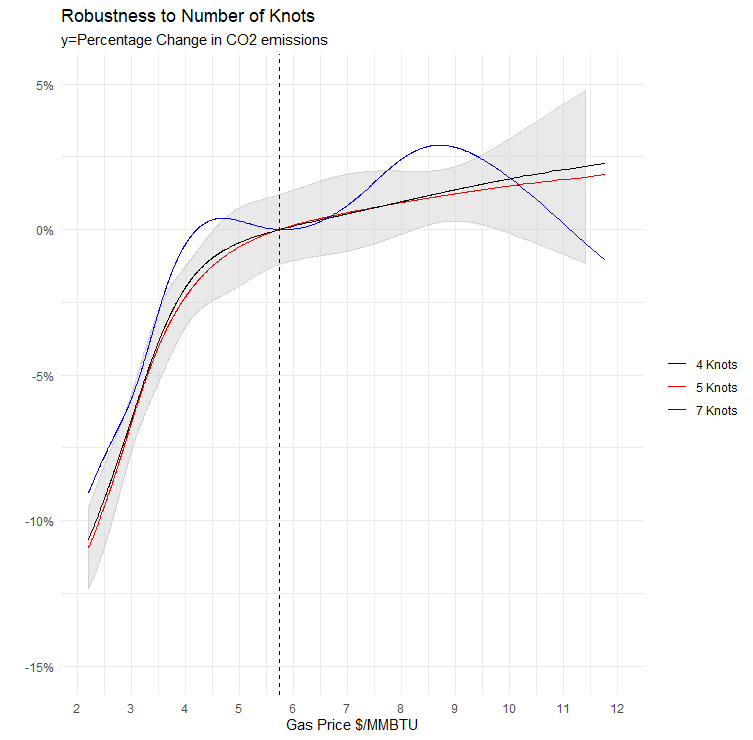
Source: Author


## Exercise References


### Bibliography

- Bushnell, J. B., Mansur, E. T. & Saravia, C. (2008), ‘Vertical arrangements, market structure, and competition: An analysis of restructured US electricity markets’, American Economic Review 98(1), 237–66.

- Cullen, Joseph A., and Erin T. Mansur. 2017. "Inferring Carbon Abatement Costs in Electricity Markets: A Revealed Preference Approach Using the Shale Revolution." American Economic Journal: Economic Policy, 9 (3): 106-33.

- Cullen, J. & Renolds, S. (2016), ‘The long run impact of environmental policies on wholesale electricity markets: A dynamic competitive analysis’, Working Paper.

- Davis, L. & Hausman, C. (2015), Market impacts of a nuclear power plant closure, Ei @ haas working paper wp-248.

- Harrell, F. (2012), ‘Regression Model Strategies‘, Springer-verlag.

- Hakes, M. (2012), ‘Principles of microeconomics‘, South-Western Cengage Learning.

- Lafrancois, B. A. (2012), ‘A lot left over: Reducing CO2 emissions in the United States’ electric power sector through the use of natural gas’, Energy Policy 50, 428–435.

- Mansur, E. T. & White, M. (2012), ‘Market organization and efficiency in electricity markets’, (Working Paper).

- Swensson, Wretman (1992), ‘Model Assisted Survey Sampling‘, Springer-Verlag.

### R Packages

- Auguie, B. (2017): gridExtra: "Functions in Grid graphics", R package version 2.3, http://cran.r-project.org/web/packages/gridExtra/index.html

- Hlavac, Marek (2018). stargazer: Well-Formatted Regression and Summary Statistics Tables. R package version 5.2.2. https://CRAN.R-project.org/package=stargazer 

- Kranz, S. (2020): RTutor: "Creating R problem sets with automatic assessment of student's solutions", R package version 2020.03.13, https://github.com/skranz/RTutor

- Ligges, U., Maechler, M., Schnackenberg, S. (2018), scatterplot3d: "Plots a three dimensional (3D) point cloud.", R package version 0.3-41, https://cran.r-project.org/web/packages/scatterplot3d/index.html

- Neuwirth, E. (2014), RColorBrewer: "Provides color schemes for maps (and other graphics)". R package version 1.1-2, https://cran.r-project.org/web/packages/RColorBrewer/index.html

- Rudis, B. (2017): ggalt: "Extra Coordinate Systems, 'Geoms', Statistical Transformations, Scales and Fonts for 'ggplot2'", R package version 0.4.0, https://cran.r-project.org/web/packages/ggalt/index.html

- Venables ,W., Bates, D. (2019), splines: "Regression spline functions and classes.", R package version 3.6.2, Part of R.3.6.2

- Wickham, H. (2016): ggplot2: "Elegant Graphics for Data Analysis", Springer-Verlag, New York, R package version 3.2.1, http://CRAN.R-project.org/package=ggplot2

- Wickham, H., Francois, R., Henry, L., Muller, K., (2018): dplyr: "A Grammar of Data Manipulation", R package version 0.8.3, http://CRAN.R-project.org/package=dplyr

- Zhu, H. (2019), kableExtra: "Construct Complex Table with 'kable' and Pipe Syntax", R package version 1.1.0, https://cran.r-project.org/web/packages/kableExtra/index.html

- Zeileis, A. (2019), sandwich: "Model-robust standard error estimators for cross-sectional, time series, clustered, panel, and longitudinal data.", R package version 2.5-1, https://cran.r-project.org/web/packages/sandwich/index.html

### Data Sources

- European Environment Agency, "Primary Energy Consumption by Fuel", https://www.eea.europa.eu/data-and-maps/indicators/primary-energy-consumption-by-fuel-6/assessment-2

- Federal Energy Regulatory Comission, "Form  No. 714 Annual Electric Balancing Authority Area
and Planning Area Report", https://www.ferc.gov/docs-filing/forms/form-714/data.asp

- Government of Canada, "Canada Energy Regulator", https://www.cer-rec.gc.ca/bts/ctrg/gnnb/lctrctxprts/index-eng.html

- Intercontinental Exchange, "Commodity Prices", https://www.theice.com/marketdata/reports

- National Centers for environmental Information (NOAA), Climate data, https://www.ncdc.noaa.gov/cag/statewide/time-series

- The World Bank , "Commodity Markets Monthly Prices",  https://www.worldbank.org/en/research/commodity-markets

- United States Environmental Protection Agency, "SO2 Trading Program", https://ampd.epa.gov/ampd/

- U.S. Energy Information Administration, "FAQ", (https://www.eia.gov/tools/faqs/faq.php?id=73&t=11)

- U.S. Energy Information Administration, "Form EIA-923", https://www.eia.gov/electricity/data/eia923/

- U.S. Energy Information Administration, "Today in Energy", https://www.eia.gov/todayinenergy/detail.php?id=43035

*All of the above links were accessable as of March 31, 2020.*

